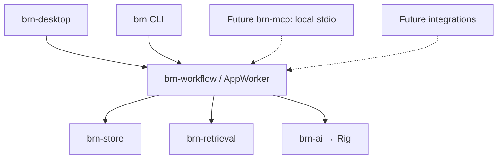

# Architecture overview

The later [selected P2 implementation](../work/active/architecture-reassessment/plan.md#selected-p2-implementation--2026-10-07) authorizes the maintained intake changes described here; earlier reassessment-only pause language below is historical for that slice. No merge/release or broader V1 implementation is selected.

> Current authority (2026-10-07): the [owner amendment](../product/BRN_PRODUCT_VISION.md#owner-amendment--2026-10-07) supersedes freeze, mandatory roadmap ordering and mechanism-preservation instructions below for this authorized whole-system reassessment. Those descriptions record the previous target/current contracts; they cannot prohibit investigation or proposed replacement. Product outcomes remain binding. Production implementation is paused; new design/sequence choices remain PROPOSED pending acceptance.

The 2026-10-03 reviewed target and 2026-10-04 client amendment describe the previous baseline; the 2026-10-07 owner amendment reopens mechanisms for reassessment. [Product vision](../product/BRN_PRODUCT_VISION.md)
supplies requirements; [invariants](invariants.md) records the governing guarantees
and resolved rules. The dated [audit](../audits/BRN_PRODUCT_ARCHITECTURE_AUDIT.md) and
[independent review](../audits/BRN_PRODUCT_ARCHITECTURE_REVIEW.md) explain the decisions,
not implementation authorization.

## Frozen target

BRN is a headless-capable knowledge/application platform with multiple clients.
The V1 application core has six crates: `brn-desktop` and `brn` consume
`brn-workflow` / AppWorker, which coordinates `brn-store`, `brn-retrieval` and the
thin `brn-ai` Rig adapter. Presentation and protocol adapters may be added when
required around this stable core; they consume the shared application boundary
without duplicating domain logic or establishing competing data authority.
An adapter crate such as future `brn-mcp` does not require a core redesign.
The reassessment proposes retaining WorkStore, derived retrieval and AppWorker initially; replacements require evidence of a simpler way to deliver the owner outcomes.

| Data | Target authority |
| --- | --- |
| Approved knowledge, converted sources, confirmed sent communications, profiles, durable relationships and meaningful history | Vault Markdown and ordinary assets |
| Actions/dependencies, sessions/citation evidence, proposals/comments/unsaved work, Inbox/Needs Review/activity/settings | `brn.sqlite` WorkStore |
| Searchable metadata, passages, embeddings and derived explicit/inferred edges | Disposable `index.sqlite` |
| Unprocessed or incompletely converted intake | Original intake files retained until complete conversion and approval |
| Trash, bounded undo and apply recovery | Ordinary files plus operational receipts |
| Credentials | Existing protected credential directory |

Proposals have one review lifecycle and typed changes enforced by the workflow. Relationships and context use existing records and derived queries; the graph is a view, not another datastore. Source wording, interpretation, approved knowledge and tentative findings stay distinguishable.

Crate count, internal ownership mechanisms, parser policies and roadmap order are open to proposed revision under the owner amendment. Portable knowledge, explicit authority, provider choice, recoverability and shared headless capabilities remain required outcomes. The [reassessment](../audits/BRN_ARCHITECTURE_REASSESSMENT_2026-10-07.md) owns the proposed direction; [plan](../work/active/architecture-reassessment/plan.md) owns proposed sequencing. Neither authorizes production work.

The [vault format](vault-format.md) records current Markdown fields, exact Source
and citation encodings, stable links and the History/archive convention. Scope
classification and provenance describe saved state and evidence, not semantic truth.

P2 adds `brn-intake`: a lightweight immutable extraction protocol and a separate
maintained MIME/DOCX helper executable. It owns format mechanics and native
containment, with no second application runtime, renderer or authority ledger.
WorkStore V16 persists exact extraction evidence; Workflow binds private analysis,
Source prerequisites and ordinary multi-asset effects to existing proposals and
recovery. The bespoke DOCX interpreter is retired; historical markup/proof readers
remain. See the [adapter contract](../../crates/brn-intake/README.md) and the
[selected P2 record](../work/active/architecture-reassessment/plan.md#selected-p2-implementation--2026-10-07).

## Semantic intelligence and deterministic authority

Owner clarification, 2026-10-05: BRN deliberately separates semantic intelligence
from deterministic authority within the current implementation.

| Responsibility | Owner |
| --- | --- |
| Interpret meaning, compare information semantically, decide which evidence to inspect, choose bounded tools, identify possible conflicts/duplicates/supersession, and produce candidate text/proposals | LLM through the existing AI lane |
| Saved-state authority, identity minting, quote/range binding, whole before records, scope/freshness, provenance verification, exact comparisons, proposal validation, approval, filesystem effects, indexing, recovery and Undo | Rust / shared workflow and its existing storage/file/retrieval boundaries |

AI may recommend evidence-backed resolutions and revise private drafts; it cannot silently make them authoritative. AI output or confidence never substitutes for deterministic evidence checks or
user approval. Semantic judgments remain candidates; Rust validates their exact
captured evidence and typed requests before granting any existing authority.
Clients continue through `brn-workflow` / AppWorker; `brn-ai` remains the thin Rig
provider adapter.

Tool inputs carry semantic intent, evidence references and exact quote text.
Rust binds each selected quote to a unique exact occurrence in the fresh saved
source body and computes its UTF-8 byte range; absent or ambiguous occurrences
refuse rather than guess. Rust mints durable identifiers, binds provenance and
the owning turn/group/session, and loads complete before records from checked
references. Idempotent callbacks bind the owning turn and canonical content.
Scope, open conflicts and freshness must travel as typed evidence with read
results; a prompt alone cannot enforce eligibility or authority. AI text cannot
change managed identity/class/state/provenance outside a validated typed
transition; explicit owner Save retains its direct byte-editing semantics.
Deterministic checks establish facts code can prove; semantic uncertainty remains
for AI assessment and owner decision.

These are required boundaries, not a claim that every existing tool already
meets them. AI Rewrite preserves exact managed kind/state/provenance/Inbox Source
field bytes; ordinary owner edits remain explicit. Typed read results now retain saved hash, identity, Source/History and explicit
unknown/known conflict facts; semantic disclosure remains unqualified; [status](../status.md) and
the affected crate contracts must distinguish implementation from qualification.
Inbox Knowledge proposal/note IDs and conflict IDs are now derived in Rust from
the owned analysis and exact semantic input. Original replay retains its evidence
and newer owner review; another analysis or changed intent is a separate draft.
Action candidate IDs are also minted in Rust from exact input in the owned turn;
AI references full replacement records through checked read_action results.
Workflow loads the full baseline and attaches selected Inbox Source evidence.
These Action corrections are integrated; independent review, automated
qualification and pending native/live/owner acceptance remain distinct in status/checkpoint.

New task-specific AI behavior introduced during V1 uses a small centralized typed
behavior/prompt boundary within the existing `brn-ai` / `brn-workflow` architecture.
`brn-ai` remains the thin Rig/provider/agent-runtime layer; `brn-workflow` owns
BRN domain/task context and deterministic application authority. Static Rust behavior definitions
are sufficient: keep task instructions and bounded tool choices together, with
typed captured input and existing deterministic validation at their boundaries.
Avoid large task instruction strings scattered through unrelated workflow or UI
code. Migrate existing prompt code only when naturally touched or when the move
is very small and low risk; this clarification does not require a prompt rewrite.
Byte-pinned prompt fingerprints detect instruction changes, not semantic effectiveness.

This rule adds no dynamic Skills system, prompt database, plugin framework,
Context Engine, second agent framework or other V1 architecture. Exact proposal approval remains required; internal ownership and roadmap ordering are open to proposed changes.

## Client and protocol boundary

`brn-workflow` / AppWorker is the stable client-facing application boundary.
Meaningful domain capabilities available to the desktop must also be available
headlessly here: scoped search/read/list, source/history access, identity,
provenance, links, relationships, proposals and activity/history. Visual layout,
focus and transient view state remain presentation concerns. AppWorker owns
admission, cancellation and coordinated work; adapters map explicit capabilities
to its commands/events and preserve errors, scopes, proofs and uncertainty.

Clients must not open vault files, `brn.sqlite`, `index.sqlite`, provider caches
or retrieval/proposal internals to implement BRN operations. Ranking, parsing,
archive/current eligibility, graph derivation and proposal rules belong to the
existing core. Public workflow DTOs may carry exact evidence and operational
preconditions; they are not permission to bypass the boundary. Retrieval engines
remain replaceable behind this boundary without changing client authority rules.

The first future MCP adapter is read-only local stdio: its process opens/owns
the headless application and follows the existing exclusive ownership rules.
For example, search/read/list default to Current; Source, History and All require
explicit scope. Relationships and provenance use their existing typed workflow
queries. A protocol connection grants only exposed capabilities, never general
filesystem/SQL access. Future agent writes must create review work through the
existing exact proposal/approval lifecycle.

The current CLI is owner-operated and exposes full owner authority, including
approval, Save and completion. It is not a restricted external-agent channel.
Agent interfaces expose read/propose capabilities only unless the owner explicitly
delegates more; possession of a CLI or protocol connection is not delegation.
Approval, completion, attestation, finding closure and Save remain owner commands.
This policy does not claim that the current CLI enforces caller identity.

No `brn-mcp` is added merely for this amendment. A daemon, simultaneous-client
coordination, remote access, HTTP/network listener, cloud service, sync or
authentication server needs a later concrete requirement. The proposed V1 delivery order is recorded in the reassessment plan.

## Implemented baseline

The six V1 core crates are the current production workspace. The retired Store/Workspace,
legacy worker/CLI/native paths, `brn-core` sample shell and `brn-flow` driver are
removed. Historical decisions and experiments remain evidence. Old or mixed
database/backup markers are refused before SQLite opens; no old data is migrated.
[Status](../status.md) records actual verification and acceptance.

| Crate | Current responsibility |
| --- | --- |
| [brn](../../crates/brn/README.md) | Owner-operated CLI over AppWorker |
| [brn-desktop](../../crates/brn-desktop/README.md) | Native presentation, exact text buffer, layout and AppWorker commands |
| [brn-workflow](../../crates/brn-workflow/README.md) | Application/chat/account/model lanes, vault, Save/recovery and bounded AI capabilities |
| [brn-store](../../crates/brn-store/README.md) | WorkStore integrity, backups, chat, proposal review, exact editor recovery and Save journals |
| [brn-retrieval](../../crates/brn-retrieval/README.md) | Disposable current-note FTS5/embedding index and evidence |
| [brn-ai](../../crates/brn-ai/README.md) | Explicit account/model selection, protected authentication and Rig streaming |

App owns WorkStore, optionally binds one current vault and shares one loaded
embedder/search policy between Library and AiTools. UI and CLI keep SQL, provider
and retrieval implementation out of presentation state. AppWorker owns admission,
cancellation and joined work; credential selection/settings reads happen inside
its lane. Native defaults to BRN-simple and its protected credential sibling.

## Reusable mechanisms and BRN responsibilities

Use the [compatible reuse decision](decisions/2026-10-06-compatible-reuse.md)
when choosing implementation mechanisms. It records the existing Rig, Markdown,
SQLite, GPUI and Office decoder dependencies separately from BRN's deterministic
authority and preservation contracts, and distinguishes pending replacements from
implemented architecture. The [workflow](../development/workflow.md#compatible-reuse)
owns the proportional reuse rule across all development.

## Simple Markdown Save and recovery

`brn-workflow::editor` coordinates exact WorkStore baselines, buffers, intents
and receipts. Fresh file observations remain separate from recovery text. The
private macOS file adapter validates descriptor-relative containment, root/parent
identity, ownership and attributes; it requires Foundation coordination,
attribute-preserving atomic exchange/exclusive installation and durability.
Missing originals are not recreated. Copies use independent unused destinations.

Save binds submitted generations. Acknowledgements preserve later typing.
Reconciliation uses prepared/installed/displaced identity proof without repeating
writes. Unresolved saves fence search/AI and further original Save. Reload binds
reviewed disk state and explicit discard. WorkStore retains the latest Applied
recovery pair and compact settled receipts after proven artifact retirement;
unresolved work and unexpected artifacts stay protected. Guarded navigation and
quit wait for acknowledged recovery. System quit drains admitted work but cannot
promise unadmitted typing.

## Chat, search and models

New Ask refreshes the vault, freezes explicit provider/model selection and uses
current read-only tools plus an Ask-only Action review capability. Workflow owns
its captured session, source proofs and exact creation replay; real Actions still
require exact human approval. Streaming is provisional; durable terminal pairs and
visibly unsaved partial failures stay distinct. Bound UUID replay never submits
another provider request. Chat/account/read leases drain before authority releases.

Fresh Ask also captures an explicit low/medium/high reasoning effort, persisted
independently in settings and paired V7 history. The thin Rig adapter sends that
choice on the selected route. Setting changes affect new requests; historical
unknown effort remains unknown and replay never initiates another provider call.

Current retrieval is derived from supported saved files. Dirty recovery is not
current source evidence. Results validate fresh bytes; results spanning Save or
unresolved work are rejected. Default builds explicitly use keyword-only search;
optional native features load FastEmbed/ONNX and require fresh consent for model
installation. Startup and saved consent never initiate downloads or login.

## Typed review foundation

WorkStore V4 and AppWorker now persist typed Markdown drafts, exact before/source
bindings, full edits, temporary comments and rejection. One review version guards
late Rewrite results; uncertain anchors retain their old range without guessing.
Draft/edit/comment operations do not apply knowledge. Exact reviewed approval
now applies through AppWorker and the CLI, preserving whole-proposal proof and
later editor work. Shared activity, explicit Undo/Trash and proof-bound human
Finish/Restore repair use the same typed application/recovery boundary. Owned AI
Rewrite uses the existing chat lane and one narrow V6 operational job, committing
validated review text and outcome atomically against its captured stamp/hash.
Jobs retain safe metadata only; restart interrupts without retry. Native full
review/edit/comments and Rewrite controls use persistent text widgets and guarded
AppWorker acknowledgements. Native exact individual/group approval captures full
records and binds every outcome; activity/reconciliation use shared receipts.
Native Undo/repair captures shared full previews with stable operation/attempt
identities and exact outcomes. Native initial Create/Replace/Trash composition
captures saved source versions through AppWorker and retains the exact submitted
request separately from later input. Completed acknowledged AI answers may
explicitly prefill review work; existing owned Rewrite operates on real stored
seed drafts. Neither route applies Markdown without exact approval. Later domains
extend these same typed changes.

WorkStore V5 adds exact approval snapshots, all-member prepared proofs and
whole-proposal receipts. Pending/Uncertain journals fence current reads and
conflicting Save/reload while keeping review and unfinished editor work readable.
Storage does not install files. Workflow stages all members, persists prepared
proofs in SQLite and bounded ordinary recovery receipts, then uses coordinated
exchange/exclusive installation and required durability. Whole completion is
persisted before SQLite finalization. Every startup imports retained records
before binding current evidence, including healthy older/fresh databases;
completed historical replay preserves subsequent user file edits. Partial or
incompatible proof stays fenced. Ordinary receipt/comment cleanup never removes
unexpected artifacts. These receipts implement the current ordinary-file recovery
boundary rather than adding another datastore.

## Inbox copy cleanup and recovery evolution

The owner's [text Inbox copy rule](../product/BRN_PRODUCT_VISION.md#73-original-intake-files)
requires an approved Source that still proves exact original preservation plus
explicit owner confirmation. Failed analyses, pending consequence drafts and
later derived-note edits do not block copy cleanup. Processed/dismissed disposition
is separate operational state. There is no automatic deletion or purge; removal
is recoverable and never removes the approved Source. The corrected read-only preview selects one complete approved Source witness:
Rust reconstructs conversion from the exact original and checks its saved body,
UUID, provenance and Source classification. Later owner header Save, relocation,
History or a visible archive may qualify if those proofs survive. Dirty editor
work is separate; unresolved filesystem authority still fences qualification.
The full consequence review remains independent. The Store prerequisite now
provides typed lean Remove/Restore records in V15: one preservation witness,
explicit confirmation and a direct settled parent. Its checked inventory and
atomic streaming import retain full authority, while historical format1 bytes
and semantic checks remain readable unchanged. Removal/Restore admission and effects plus native controls are implemented,
automated verified and integrated; unlocked native/live/owner acceptance remains
pending. Imported evidence is not permission to remove.

Extend approved vault and ordinary-asset effects through existing typed
proposal-apply members. Extend private intake effects through the original-operation
family. A proposed new recovery mechanism must show why existing mechanisms are insufficient or more complex; implementation still needs owner selection. Existing Save/recovery mechanisms remain
in place; additive WorkStore tables are local implementation choices, not new
data authorities. This guidance does not authorize automatic migration or removal
of existing recovery evidence. Knowledge approvals need their genuine captured
analysis when recovered into older/fresh operational state; the exact capture
companion retains that minimal evidence within the existing proposal-apply
family independently of original-operation records. Do not reconstruct provider choices, questions, times
or historical Source bytes, and do not create a new execution during recovery.

## Domain consistency checkpoint

The [product glossary](../product/glossary.md) consolidates settled language; it
adds no product decision, schema change or code rename. Product Vision plus owner
amendments govern intended behavior; architecture/invariants preserve ownership;
current contracts/source establish implementation, and evidence establishes only
its observed qualification. Historical plans do not override these authorities.

| Concrete case | Settled rule and observed gap |
| --- | --- |
| An approved Source says blue; current knowledge says red | Source approval preserves evidence. It does not promote blue or resolve the contradiction. A separate exact knowledge proposal is required; Findings remain tentative. |
| A visual description is approved | One ordinary inline DOCX PNG and separately approved provisional annotation are integrated. Original image/wording stay distinct; broader visuals and semantic completeness are unqualified. |
| A Source has `brn_state: current` | It remains excluded from default Current knowledge; explicit Source can include historical Sources. History and Source overlap; All is not permission to treat every claim as current truth. |
| A supersession succeeds | The predecessor becomes History at its existing path; it is not trashed. Top-level archive is a read-only History alias, not the universal removal destination. |
| A Finding is Resolved | The queue state changes; this alone changes no note or Action. Existing evidence inspection can say Changed/Unavailable without guessing a new anchor. |
| An Action is completed, then new work arrives | Completion remains direct owner authority; follow-up is a new approved related Action. Action-bearing Undo remains refused pending its inverse contract. |
| An application is uncertain | Existing Finish/Restore repair resolves checked effects; it is distinct from Undo of an already Applied change and from restoring a trashed object. |
| A binary Source is approved | Binary original-copy cleanup remains refused. Text-copy removal has its separate exact-preservation and owner-confirmation contract. Broader binary cleanup is an implementation gap, not implied permission. |
| A session is archived or deleted | Product requires reversible Archive and capture warning before Delete, preserving durable knowledge. Stage13 remains unimplemented; existing note History/Trash does not establish session lifecycle. |

Documentation disagreements corrected here: status/handoff still called landed
PR78 open; vault-format's asset paragraph still described a text-only baseline.
The paused roadmap language is reconciled without changing its sequence. The remaining gaps require selected slices and their own acceptance evidence. The dated reassessment reopens mechanisms without claiming a production change.

## Build boundaries and remaining work

Default workspace checks exclude optional native UI/retrieval. Standalone
experiments retain their own manifests/lockfiles and are outside production.
Build/state tests do not establish GUI usability, real inference, provider
capability or release readiness. Proposal Core and the remaining product stages
follow the [roadmap](../roadmap.md); no generic publication or workflow framework
is retained from earlier designs.
