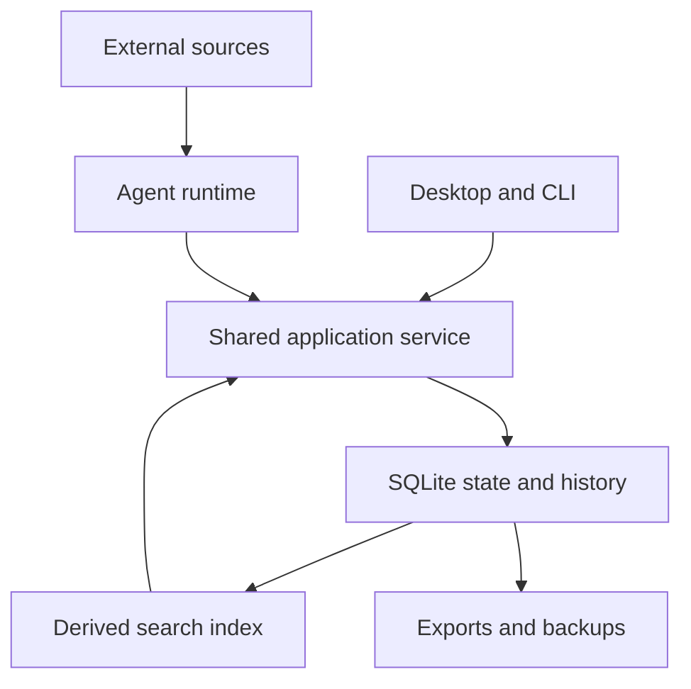

# BRN Threads architecture overview

The [canonical Threads target](threads-target.md) owns the detailed architecture. This page is a navigation summary. The setup commit changes the target and routing; the code still implements the baseline until replaced.

## One state owner

SQLite owns current records, immutable meaningful revisions, threads, Actions, source observations, change receipts, authorization, and run progress. Small retained note assets may live in the same database. Search indexes are derived and rebuildable.

One checked change mechanism handles direct owner Save, delegated AI maintenance, reviewed candidates, and Undo. Record versions cover relevant metadata and protection as well as content. Canonical commits are serialized initially; model calls and external processing stay outside transactions.

## Recovery and interaction

Undo records a new compensating operation. Immediate grouped Undo is required. Later conflicting edits can require a reviewed compensation; no whole-database rewind or automatic semantic merge is promised.

Defer autonomous writes to a note with unsaved owner writing. Retain meaningful revisions and comment context; unresolved anchors remain visible. Start with ordinary editor tracking and current/proposed comparison. Add a CRDT or editor fork only after evidence of a concrete need.

## Reuse boundary

Reuse useful GPUI controls, provider integrations, maintained decoders, and retrieval capabilities. The existing crate map is a source of components, not a frozen architecture. Replace mutable-vault coordination, blanket proposal gating, original-copy recovery, temporary comments, and old-state readers when implementing the new core.

Full-note import shares the same notes, assets, source references, and protection model as other work. Qualify converter and reader coverage without building a universal source renderer.

## Contracts and next action

Read the [invariant summary](invariants.md), [build plan](../work/active/threads-rebuild/plan.md), and [review brief](../work/active/threads-rebuild/review-brief.md). The [fixed baseline](https://github.com/ewq100/brn-rust/tree/af9239c741c7ab0983e62f0253e607b9607727e6) preserves prior implementation and evidence.
