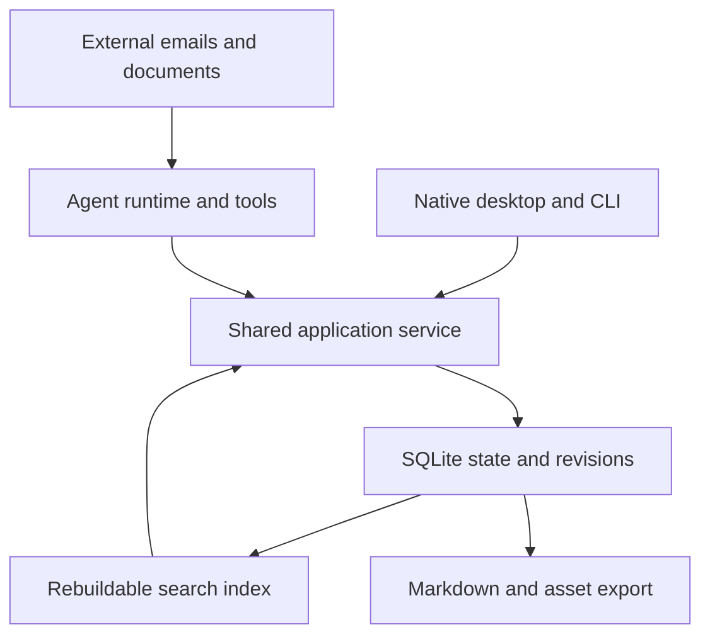

# BRN Threads canonical target

**Status:** Selected target for the prepared rebuild branch, 10 October 2026. Product implementation starts when a build agent is assigned. This document does not claim that the redesign, autonomy policy, or recovery guarantees are implemented or enabled.

**Authority in this branch:** This is the canonical target. The owner requested a prepared build environment after refining the proposal. [The rebuild plan](../work/active/threads-rebuild/plan.md) owns execution; [AGENTS.md](../../AGENTS.md) owns assignment routing. Older baseline contracts are historical evidence. The published discussion proposal was the source of this target; ongoing implementation decisions belong here.

**Date:** 10 October 2026. **Owner:** Evo.

**Review reconciliation:** The independent review is resolved into this target and the [build plan](../work/active/threads-rebuild/plan.md); see [lead dispositions](../work/active/threads-rebuild/review.md#build-lead-dispositions). The [thread and agent behavior design](threads-behavior.md) makes the selected interaction and instruction defaults concrete without becoming a second product specification.

**Owner scope:** Original emails and files stay in Outlook or their existing locations. BRN maintains useful extracted knowledge and source references. Selected key documents can also be imported as complete, readable notes, preserving substantive content without reproducing page layout or retaining the original binary. DOCX, PPTX, and HTML output are required later capabilities, outside the first usable release. No gradual data migration is required. Mathematical equation conversion and typesetting are outside the first release; Evo does not plan to import mathematical material. Full prose, tables, process steps, and meaningful figures remain in scope.

**Baseline examined:** `ewq100/brn-rust` at commit `af9239c741c7ab0983e62f0253e607b9607727e6`. Repository findings below describe that snapshot. Recommendations are design judgments, not measured development-time or code-size savings.

## Recommended decision

Build BRN as a local workspace in which an AI agent maintains useful knowledge, carries work forward, and opens a thread when the owner needs to decide something. Give the owner a good editor, understandable changes, protected decisions, and dependable undo.

The central product promise is:

> Give BRN information and a goal. It keeps the relevant working knowledge useful, tracks the work, and brings you the decisions that require your attention. You can inspect what changed and recover your local work.

Adopt six architectural decisions together:

1. **One authoritative SQLite store** for notes, revisions, threads, Actions, changes, and authorization records. Keep useful extracted information, explicitly requested full notes, and source references, without an original-file archive. Produce fresh portable Markdown snapshots on demand; add DOCX, PPTX, and HTML generation after the first usable release.
2. **One thread workspace** for asking, investigating, discussing, editing, reviewing, and following up. The attention queue shows decisions and work requiring attention; routine maintenance stays quiet.
3. **One application service and change mechanism** shared by the desktop, built-in agent, CLI, and eventual external agents. Human review and delegated autonomous work use the same commit path.
4. **Broad autonomy over ordinary local working knowledge.** The normal maintenance delegation excludes protected notes. A specific applicable owner instruction or review can authorize changes to protected decisions and writing without redundant confirmation.
5. **AI performs semantic work** through shared tools: interpretation, organization, summarization, conflict investigation, and planning. Deterministic code handles persistence, identity, authorization, concurrency, recovery, and execution limits.
6. **A fresh implementation in the existing repository.** Use one rebuild branch and worktree, a fresh final-use core crate and schema, and updated active instructions. Borrow useful GPUI, provider, retrieval, and import capabilities from a fixed reference commit. No gradual user-data migration, dual-writing transition, or permanent compatibility layer is required.

This deliberately changes the original “Git for your knowledge” framing. Keep understandable revisions and recovery. Branch trees, rebases, permanent keystroke histories, and multiple independently writable stores are unnecessary prerequisites for the product described here.

### Owner assumptions already supplied

Evo is not using the current app and does not need a gradual migration. Development is performed with AI assistance. Refactoring or rewriting as much as needed is acceptable, and the vision may be challenged to reduce complexity. Greater runtime AI autonomy should be considered where it removes unnecessary code and interruption. Original emails and files remain external; BRN does not need to store another copy of every imported item. For selected key documents, such as research papers and process descriptions, Evo must be able to read the complete substantive content as a BRN note. Later document, presentation, and HTML generation are part of the intended product.

Retain the useful existing owner outcomes: English and Estonian notes/conversations, answers in the owner's language, and personal-scale retrieval around 5,000 active notes with rebuildable indexes. Preserve explicit provider, account, model, and supported reasoning-effort choices without silent fallback. These outcomes do not require a new multilingual framework or complex retrieval engine. [Baseline vision][vision]

A current explicit instruction takes precedence over a saved owner preference and a product default. An inferred preference or a one-off instruction must not silently become a standing owner policy. Credentials stay outside knowledge, exports, and logs. Headless capabilities use the same service and scoped authorization; possession of a CLI or connection does not itself grant owner authority. [Baseline vision][vision]

Those statements authorize this target’s scope. They do not establish that today’s rollback already supports the new operations, or that any proposed default has been enabled. Recovery must be demonstrated early in implementation.

## The product model

### Four concepts the owner needs to understand

| Concept | Meaning | What it does not need to become |
|---|---|---|
| **Notes** | Current working knowledge, writing, and full imported documents. A note can be protected to preserve a reference, wording, or decision. | A repository, a branch tree, or a mandatory conversation. |
| **Threads** | Context around a question, decision, or piece of work, linking notes, sources, changes, and Actions. | The storage format for every fact or every task field. |
| **Actions** | Work to consider, perform, or follow up, with explicit progress and completion evidence. | A chat message whose existence implies commitment or completion. |
| **History** | Meaningful changes, reasons, actors, source references, decisions, and recovery. | Permanent replay of every keystroke or model token. |

A pending AI revision is a change inside a thread. It does not need a separate product with independent navigation, branches, and lifecycle rules.

Source references belong to notes, changes, and Actions as provenance. The owner can open an Outlook reference or follow a document link from the work it supports. A small internal source-reference record supports identity and deduplication; it does not create a fifth archive or source-management product.

People, projects, meetings, and policies can initially be ordinary notes with useful metadata. A possible contradiction can be discussed in a thread. Add a specialized record type only when a concrete query or operation needs it; avoid building a separate workflow engine for each subject the owner writes about.

### Home and the working surface

Home contains a **Needs you** queue and an **Ask or delegate** input. It can also show recent work and a quiet **What changed** view. Ordinary notes remain directly browsable and editable.

Opening a thread presents its conversation, relevant source excerpts, current note, pending changes if any, and linked Actions in one workspace. The editor opens when the work involves writing. A simple question should not force the owner into an editor.

Note comments and task conversations share the same thread machinery. A note comment adds a document location; a task thread can link several notes. A thread may be resolved while an associated Action remains Waiting. The interface must show that remaining obligation rather than silently closing it.

Do not generate a new attention item for every imported source or automatic update. The agent groups related work and adds to an existing relevant thread where appropriate. A completed maintenance run may simply record “Updated the project summary from three new sources.”

### Small Action lifecycle

Use **Suggested, Open, Waiting, Done, Cancelled** initially. Add a blocked reason to an Open or Waiting Action if needed; do not build a general project-management workflow engine first.

An incoming request may create a Suggested Action automatically. An explicit owner instruction such as “Prepare the project update for Friday” authorizes an Open Action immediately. BRN should not ask whether it may record the task the owner just assigned.

AI can maintain context, links, and routine progress. It can mark an internal task Done when its defined result has been produced and recorded. It must not infer that a human task or external commitment is complete merely because a draft exists, a thread was resolved, or a reply was prepared. Owner confirmation or relevant execution evidence supplies that result.

## Autonomy as the normal working mode

### One standing delegation

The recommended workspace delegation is:

> Maintain ordinary working notes, organize incoming information, prepare work, and track suggested Actions within this workspace. Capture useful meaning and references back to external sources, record meaningful changes, and keep BRN’s work recoverable. Bring me conflicts involving protected decisions, new commitments that need my choice, and actions outside the granted scope. Use my selected provider and the agreed run budget.

Once the owner chooses this delegation, the app should not ask again for each routine update. The scope and an accessible Pause control belong in workspace settings. A simple “Review changes first” setting can support a workspace where the owner wants less autonomy. Do not begin with a large permission-rule editor or a matrix of paragraph-level trust modes.

| Work | Recommended default | What the owner sees |
|---|---|---|
| Search, compare, extract, summarize, investigate, draft | Autonomous within the delegated scope and selected provider | Progress and a useful outcome; no approval ceremony for intermediate steps. |
| Create and revise ordinary working notes; organize and link them; archive superseded ordinary material | Autonomous, grouped into recorded changes | A concise change summary, sources, and Undo. |
| Create suggested Actions; update their context | Autonomous | Suggested work, grouped by relevant thread. |
| Record a task the owner explicitly assigned | Apply directly under that instruction | An Open Action with the instruction attached. |
| Change, archive, unprotect, or supersede a protected note | Requires owner authority for that change | A focused proposed revision, or direct application when the owner already gave a sufficiently clear instruction. |
| Make a new commitment on the owner’s behalf, change an agreed scope or deadline, or claim a human obligation is finished | Requires relevant owner instruction or recorded execution evidence | A specific decision, not a generic “Allow AI?” dialog. |
| Send, publish, buy, book, or change another system | Separate explicit or narrowly delegated external capability | The intended effect and its outcome; external delivery is never described as reversible through local Undo. |
| Change provider, expand data access, grant capabilities, or permanently erase BRN knowledge/history | Owner-controlled | An intentional setting or operation, outside ordinary maintenance authority. |

Recording that a source reports a changed deadline is autonomous knowledge maintenance. Agreeing to that deadline on the owner’s behalf changes a commitment. The same date can appear in both situations; the agent must preserve the distinction in the note and the Action.

### Ordinary notes and protected notes

Use whole-note protection initially. Ordinary notes are working material that AI may maintain within delegation. Protected notes are decisions, writing, or imported references whose content should be preserved. Human writing does not automatically require a separate protected copy; the owner can protect any note when that behavior is useful. Full document imports start protected under this same policy; requesting the import authorizes their creation without another approval. AI may create linked summaries or working notes and add comments without rewriting the reference. An owner instruction can authorize correcting the import, replacing it from a new source version, or adopting it as a working note. Protection controls editing; confirmation records an explicit owner decision at a particular revision. Importing or protecting a research paper does not confirm that its claims are true, and importing a process does not adopt it as the owner's policy.

Protection applies to content and to changes that would hide or displace the record, including archiving, deleting, unprotecting, and marking it superseded. The agent cannot bypass it by creating an ordinary note and declaring that the protected decision no longer applies. The application enforces structural changes; the agent is instructed to surface semantic conflicts. Semantic conflict detection is an AI judgment and cannot be guaranteed by a database constraint.

“Record this as our decision” is sufficient authority to create the protected decision described by that instruction. “Change the confirmed deadline to 15 November” can authorize that specific edit without another click. When the instruction leaves the consequential choice unclear, prepare the result for review. The host records the user message or review action as authority; the model cannot manufacture an owner-confirmation receipt in its output.

A message reference is evidence, not an unrestricted grant. The host retains the capability and target scope authorized by the trusted user interaction. The model cannot expand that scope by citing an unrelated message or source. Interpreting a natural-language instruction remains fallible semantic work; structural checks enforce the resulting scope but do not prove that interpretation correct. Bind a grant to the trusted instruction/review, permitted action, concrete record IDs, and bounded run/purpose. A selected note, explicit record reference, or displayed candidate can supply the target; an ambiguous consequential target becomes a concrete review candidate. Merely reading a note, mentioning it, or linking it to a thread supplies context, not permission to edit it. Permission to revise content does not also grant unprotect/archive/supersede or commitment changes. Records created during a run are not automatically owner-confirmed. Carry the grant or its host-validated reference through host-only tool context, never a model-supplied authority argument.

### Current does not mean personally reviewed

This is the largest change to the original trust model: **current working knowledge may include AI-maintained content that the owner has not manually reviewed.** That is necessary if BRN is to keep information useful without sending every change back to the owner.

Keep the distinction understandable. Show who changed a note, when, why, and from what evidence. Explicitly confirmed decisions identify the revision the owner confirmed. A later automated edit cannot inherit that confirmation. Avoid a new workflow state for every possible combination of authorship, source, confidence, and lifecycle.

Default retrieval includes current ordinary and protected notes. It excludes pending candidates, superseded revisions, archived material, and scratch work unless requested. Useful extracted information, selected excerpts, and intentionally imported full notes remain local. External references can be opened or reread when accessible; BRN reports when it cannot currently recheck an original. When new evidence conflicts with a confirmed decision, the answer should state the discrepancy and link the decision thread; it should neither hide the new evidence nor silently replace the decision.

Undo reduces the cost of a bad local update. It does not establish factual accuracy, and it cannot reverse a decision someone already made after reading a mistaken summary. This is why provenance, visible conflicts, and protection for consequential owner decisions remain useful even with broader autonomy.

### External effects and model access

The first usable Threads release prepares replies for copying into the owner’s existing communication tools. Direct sending and broad connector automation are deferred. The data model may retain execution receipts so those capabilities can be added without redesigning history.

Later external delegation can be narrow and useful, such as a particular recurring update to an established recipient. A clear “Send this reply” instruction may itself supply authorization; BRN should not demand redundant permission after the action is concrete. Local Undo cannot unsend a message, retract a disclosure, undo a purchase, or restore provider quota.

Local storage also does not imply local inference. Workspace data passed to the selected model follows that provider path. Allow the agent to retrieve broadly inside the scope the owner has delegated, while keeping provider selection and access expansion under owner control. Imported source text is evidence, never authority to grant tools or transmit additional data.

## Requirements to change or remove

These are deliberate product amendments, not hidden implementation substitutions. The baseline vision currently couples authoritative knowledge to Markdown, durable AI changes to human approval, and V1 acceptance to a broad feature set. Its architecture also specifies cross-store recovery mechanisms. [Baseline vision][vision] [Baseline invariants][invariants]

| Existing requirement or proposed mechanism | Recommended replacement | Benefit and real tradeoff |
|---|---|---|
| AI changes become current only after exact owner approval; human Save already supplies direct authority | Delegated AI maintenance is current; explicit decisions are protected | Removes routine AI approval workload; current notes may contain unreviewed AI errors. |
| Markdown vault is the live authority | SQLite owns live state; Markdown/assets are exported as fresh snapshots | Simplifies coherent updates; external editing becomes explicit import. |
| Retain the original email, document, or attachment for every intake item | Keep useful knowledge and source references; offer full readable notes for selected documents | Removes the original-file archive; a full note remains readable locally, while exact original-file reinspection depends on the external source. |
| External edits to authoritative Markdown are recognized at scan/open; changes during BRN editing need conflict handling | BRN owns live editing; outside changes enter through explicit import | Removes outside files as a competing live authority; portability remains. |
| Full permanent operation replay | Meaningful revisions, comments, changes, and recovery autosave | Smaller history model; no promise of indefinite keystroke replay. |
| Jujutsu repository and branch per proposal | Immutable base and candidate revisions in the existing transaction store | Avoids a second history authority; no full VCS product. |
| Mandatory Loro or Yrs overlay | Use editor range tracking and revision anchors first; add a CRDT only for demonstrated needs | Removes an up-front storage/serialization layer; some edited-away locations become unresolved. |
| Comments always follow the intended meaning through every edit | Preserve original revision and quote; track supported edits; show moved, removed, or unresolved locations honestly | A clear implementable contract; no universal semantic anchoring promise. |
| Arbitrary partial hunks across parallel draft branches | Review independent document or Action groups, or edit and accept a final candidate | Faster review implementation; deeply interdependent edits are accepted as a coherent group. |
| Byte-identical round trips for every mutable note | Preserve useful meaning, or complete substantive content for a full import; commit the exact reviewed result | Avoids a lossless layout and input-reconstruction project; full note conversion still requires faithful content and honest coverage. |
| Separate product flows for Inbox, findings, proposals, chat, and task review | Common thread workspace with typed notes, sources, changes, and Actions | Removes duplicate orchestration and presentation while preserving distinct meanings. |
| Every incoming item opens work for the owner | AI completes routine intake and groups actual attention needs | Reduces queue noise; useful prioritization becomes agent behavior to evaluate. |
| Prove converted content can replace originals, then manage original-copy cleanup | Process external sources read-only and discard BRN’s temporary intake copies | No original-retention or cleanup product; missing content is reported, and retry may require access to the source. |
| Specialized admission, evidence-binding, and orchestration callbacks for each AI mode | General thread tools and instructions with one host authorization/application boundary | Less route-specific glue; substantive behavior still needs agent evaluation. |
| Carry old persisted state and compatibility paths forward | New schema and data directory; preserve old repository/evidence separately | Frees implementation choices; no automatic old-state continuation is promised. |
| Ship every old V1 feature before daily-use evaluation | Accept a smaller set of complete daily-use journeys | Earlier real feedback; deferred features are visibly outside the first usable release. |
| Preserve crate count, command names, and old callback structure | Preserve user capabilities and a shared headless service | Allows useful refactoring without preserving obsolete abstractions. |

## Architecture and authority

### One live state owner

Use SQLite as the authority for document content and revisions, threads and messages, Actions, change sets, source references, authorization records, and run state. Original emails and files stay external. Small selected images or diagrams that are useful knowledge can initially live in the database as note assets; do not introduce an external asset store until actual usage justifies it.

The diagram represents authority and data flow, not a requirement for separate processes or crates. Begin with one desktop application and one serialized application write boundary. Agent reads can run concurrently; canonical commits pass through the shared service. Serialization must hold across desktop and CLI processes through SQLite transactions, using an immediate writer transaction or an equivalent demonstrated boundary; an in-memory desktop mutex is insufficient. Check authorization, current record versions, and persisted editing guards inside that boundary.

SQLite transactions allow related database updates to commit together. That lets a change to three notes, an Action, and its history receipt have one internal commit boundary. The guarantee applies to database state; reading an external source and writing an exported deliverable are separate operations. [SQLite transactions][sqlite-transactions]

Do not build a general event-sourcing framework. Store current records and immutable revisions directly, plus enough before/after information and authorization evidence to explain and reverse changes. The application should open current state without replaying its entire lifetime of events.

### Useful extraction and external references

BRN offers two intake choices through the same decoding and change mechanism:

| Import choice | Intended result |
|---|---|
| **Use information** | Default for routine intake. Update relevant notes, create useful knowledge, add thread context, or suggest Actions. A source may contribute two facts or a detailed explanation; there is no mandatory note per input. |
| **Import full note** | For selected key documents. Create one complete, readable BRN note containing the document's substantive content. A research paper or process description remains available for full reading inside BRN. |

Both choices may temporarily download or decode the source and both retain provenance. Neither requires keeping the original PDF, DOCX, PPTX, or email file. The full-note choice intentionally retains normalized content as knowledge; it is not an automatic archive of every input.

Agent-friendly content means clear Markdown with headings, explicit names and dates, meaningful tables, and structured Action fields. Preserve relevant numbers, units, qualifications, requests, decisions, and dependencies. A technical plan may deserve a detailed note; a confirmation email may change only two facts. Do not make every intake result a short summary that discards information needed for the work.

Retain a compact reference: source system/location, available link or identifier, useful title and sender/author/date, when BRN read it, and a source revision or fingerprint when available. These fields are best effort; a pasted source or local file does not need a connector or permanent URL before it can be useful. Save a selected exact passage when its wording matters to a decision or dispute. Do not automatically keep the entire message body or complete extracted facsimile of every document as a second archive.

When a table carries useful information, retain its values, labels, and qualifications in text or structured data. A diagram or image may be saved as a note asset when it is itself useful knowledge. For full imports, preserve all substantive supplied figures, whether or not they matter to the immediate task. Decorative images, every slide rendering, master layouts, animations, and unrelated attachments do not need preservation. Record material extraction gaps; omission of decoration is not an attention item.

An external reference is a route back to the source, not a guarantee that it will remain available or unchanged. Previously extracted knowledge and imported full notes remain usable locally when Outlook or a file location is unavailable. BRN can say when and where it learned something, while making clear that it cannot currently recheck the original. Re-reading through connectors is a later capability where not already available; the first release may simply let the owner open or resupply the source.

### Full note import

Full import is faithful conversion, not summarization. Preserve the source's substantive wording, section hierarchy, reading order, numbered steps, prerequisites, roles, branches, exceptions, warnings, qualifications, tables, captions, meaningful footnotes, references, and appendices. Remove repeated page headers and footers, page numbers, and mechanical line-break or hyphenation artifacts where doing so does not change meaning. Keep meaningful section headings and numbering. Do not silently paraphrase, shorten, omit difficult sections, or replace a figure's evidence with an invented explanation.

Use readable Markdown, supported table representations, and note assets for necessary figures or content that cannot be represented faithfully in text. Preserve labels and cross-references. Mathematical equation conversion, LaTeX/OMML fidelity, specialist math rendering, and mathematics-heavy fixtures are outside the first-release requirements. Retain already-readable formula text when available, without adding a dedicated subsystem. If unsupported content in a supplied document leaves a substantive gap, show that limitation instead of guessing or calling the import complete. An uncertain OCR passage is likewise a visible gap. Normalization need not reproduce original typography or pagination.

Check completion against the requested import intent. The scope is the supplied document and explicitly included supplementary material; retain its bibliography without automatically importing every cited publication. A full import can be called complete only after checks against the source's identifiable sections and substantive objects find no unresolved omissions; a model's completion announcement is insufficient. A detected missing section, unreadable table, or absent substantive figure makes the result partial, with the affected location and limitation recorded. These checks reduce omission risk; they do not establish a universal guarantee for arbitrary documents. A partial note may still be saved and protected with visible limitations. Do not report a short summary as a successful full import. Qualify each supported format before claiming full support. The first trials use a representative text-layer PDF with prose, headings, a table, a figure/caption and references, plus a DOCX process description. Compare these against a small independently checked content inventory and deliberately remove one substantive element to prove the partial outcome. Reuse a maintained PDF converter and existing helper isolation; do not build a universal PDF interpreter or completeness detector. Scanned/unsupported documents can return a clear partial or unsupported result.

Keep one logical note with section navigation even for a long document. Retrieval may index sections and load relevant passages; it must not truncate the saved note or split it into dozens of mandatory user-facing notes. A summary can be generated on demand or stored separately and linked to the relevant source revision. The saved note and its required assets remain available offline and can be exported together. Full backups include the retained import revisions and assets.

Use the existing note/revision and whole-note protection model. Record import intent, source observation, and coverage with the imported revision; no separate document archive or trust hierarchy is required. Later owner-authorized changes retain the imported revision in history and identify the current text as revised, rather than presenting it as an unchanged copy of the source.

### Temporary processing and run history

The intake sequence is read/decode, inspect the content required by the chosen import intent, prepare changes, commit them with source references and processing status, then remove temporary input material. Full-note imports inspect the complete source within the declared scope. Intake is read-only toward external systems. Processing an email or clearing a BRN queue item does not delete, move, or mark the external message handled.

Use a simple processed, partial, or failed outcome with a useful explanation. Partial extraction can still produce useful knowledge with its limitation. A failed extraction retains a reference and failure explanation, not an indefinite copy of the input. Clean up temporary downloads after completion, failure, or cancellation, and expire abandoned temporary files after interruption. Retrying may require reopening the external source or having the owner resupply it.

Apply the same policy to tool logs, run checkpoints, and automatic conversation memory: raw import/fetch payloads are transient. Persist useful derived results, requested full-note content, source references, and progress, rather than quietly archiving every email or document inside a serialized tool result. An explicitly imported full note and its required assets are intentional canonical content; temporary-input cleanup must not remove them. Normal user messages and intentionally captured quotations remain part of thread history. If a resumed run needs uncaptured input again, reread it; record a new observation if the source has changed.

Persist BRN-owned run status, budget, instruction-bundle identity, intentional thread messages/results, candidate and receipt IDs, and source references. An interrupted run continues as a fresh invocation from those records and current knowledge. Do not serialize an opaque Rig AgentRun, its provider bodies, or a wholesale tool transcript as application recovery state. Typed receipts, source metadata, deliberately saved excerpts, and useful derived results remain legitimate durable content. A recovery fixture must distinguish intentionally retained content from raw material that should expire; cleanup is not a promise of forensic erasure of storage pages.

### Exports and backups

The first release offers **Export now** for a fresh snapshot containing ordinary Markdown and selected retained note assets. Generate from a consistent committed view and identify which revision or workspace snapshot produced it. Publish the completed export only after its output verifies; retry failed work and show the last successful result. Automatic exports at checkpoints can be added when useful, but are not a first-release gate.

Never update a previously delivered snapshot in place. The owner can copy, edit, or move it; a later export receives a new destination. Outside changes enter through explicit import. This removes file watching, outside-edit detection, and bidirectional merge from the first release. Exports may lag current BRN state; automatic export retention or purging is deferred.

Offer a complete backup of BRN’s own database, selected retained assets, and necessary application state for restoring notes, threads, history, Actions, and settings. With selected assets stored in SQLite, one consistent database backup covers them; any later external asset storage must be included explicitly. Markdown export alone is not a complete backup. Use SQLite’s supported backup facilities rather than an arbitrary copy of an active database. Outlook and other external original files are outside the BRN backup and restore promise. [SQLite backup API][sqlite-backup]

### Later document presentation and HTML output

DOCX, PPTX, and HTML generation are required later capabilities. Each creates a new deliverable from selected current knowledge or a named revision: a written report, a presentation for a particular audience, or a readable HTML page. Markdown remains the initial portable representation.

Use maintained generation tools and templates when this work is selected. An AI agent can choose the outline, explanations, visual emphasis, and slide grouping; output tooling performs format generation, and previews are checked for missing content and layout problems. Relevant selected note assets travel with the output. Record which knowledge revision produced the artifact so later changes do not silently alter an already exported deliverable.

These are output formats, not new live stores. They do not require recreating the original imported DOCX layout or PPTX slide masters. Editing an exported document happens outside BRN unless the owner explicitly imports the result. Defer round-trip Office editing, a universal document model, HTML hosting, and template-management machinery until a concrete use case needs them.

### Minimal persistent model

The following are responsibilities, not a mandated table-per-row schema or frozen field layout:

| Record family | Minimum information |
|---|---|
| Document | Stable ID, title, current revision, ordinary/protected policy, archive state. |
| Revision | Stable ID, document, parent/base, supported Markdown content, actor, time, operation; for an import, its intent, source observation, and coverage. |
| Source reference | Internal ID, best available external locator/identifier, recognizable label, observation time, optional external revision, processing outcome and relevant gaps. |
| Selected note asset | Useful retained diagram/image or structured data, its note/source relationship, and content identity; small assets may live in SQLite. |
| Thread | Stable ID, goal/context, Open or Resolved state, links to relevant objects, explicit attention reasons, run references; messages and independently changing links/comments have their own identities. |
| Action | Stable ID, description, lifecycle, relevant owner/source authority, due or waiting context, completion evidence. |
| Change set and operation | Host-owned durable request/operation identity, canonical request hash, targets and expected versions, immutable candidate results and creation IDs, before/after records, reason, evidence, authority, apply receipt. |
| Editing recovery | Note and base version, edit-session identity, increasing buffer generation, retained unsaved content, and persisted dirty guard. |
| Run | Thread, selected provider/model, delegated scope, budget, instruction-bundle identity, durable progress and candidate/receipt references, cancellation/interruption state; no opaque runtime checkpoint or raw-input archive. |
| Export and backup metadata | Last successful versions, pending jobs, visible failures, recoverable backup identity. |

Full current Markdown text per meaningful revision is a reasonable starting point for a personal notes app. Measure actual storage before adding delta compression, a content-addressed document DAG, or another version-control layer.

Every mutable canonical record has a version covering its relevant content pointers, metadata, protection, and lifecycle state. Commit preconditions and Undo compare this record version, not only a text hash. Compensating changes create new versions even when they restore earlier content. Independently changing thread links, comments and provenance relationships should be separate records, so adding a link does not change an untouched note version. A note version still covers its title, content pointer, protection and lifecycle. Undo checks every record actually written by its operation, including a comment or relationship if that operation changed it.

## A single mechanism for changes and review

A change set describes an exact proposed local result: current base versions, candidate content/state transitions, supporting sources, and a useful reason. Delegated writes, owner Save, and reviewed writes use the same application service.

The flow is:

1. Read the relevant records and their current versions. The trusted host allocates and durably records a request/operation identity before dispatching preparation. One identity can serve both purposes; do not require two ID systems.
2. `prepare(operation_id, request)` stores an immutable candidate with a canonical request hash and preassigned IDs for created records. Repeating preparation with that identity and identical request returns the same candidate; changed content with the same identity is an error. A lost preparation response therefore cannot create another logical request.
3. Validate references, allowed operations, host-bound scope, protected records and expected bases. Apply under standing delegation or a sufficiently specific current instruction; otherwise attach the candidate to its thread for review.
4. `apply(operation_id)` returns an existing receipt to an authorized caller before checking mutable bases. This replay must work even though the operation's own successful write advanced those versions. For a new application, acquire the SQLite writer transaction and recheck versions, authorization and editing guards.
5. Commit related revisions, Action changes, source references/assets, and one unique receipt atomically. No model call, source fetch, or long investigation runs inside the write transaction. A guarded or stale member cannot cause an unexplained partial group application.
6. Return a typed outcome and show a concise summary backed by the actual receipt. Export reads a committed snapshot separately.

Persist the host's pending request identity in its BRN-owned run/editor/command state before a retry can be necessary. The ID is not minted or remembered solely by the model. Qualification covers loss of the response after preparation and loss after application commit, including creation as well as updates. Do not reintroduce a filesystem apply journal or an uncertain half-applied state for an entirely SQLite transaction.

For review, show current text and the proposed result with understandable highlighting. Initially a review group is one complete proposed note revision or an explicit Action change; related groups can be accepted together. The owner can edit final candidate text before acceptance. The agent explains relationships between groups; the core does not attempt to prove semantic independence. If selecting a subset requires a rewrite, create and show the refreshed immutable candidate. Approval binds the displayed result and does not authorize a later model rewrite.

Allow one active proposed revision per note initially. Another thread can refer to it or ask for a refresh. Avoid competing draft branches. If a note changed after preparation, return Stale; the agent may reread and regenerate under existing delegation. A manually reviewed replacement needs updated review unless a separate applicable owner instruction already authorizes it.

### Human Save and active writing

Save always carries the editor's expected base version, edit-session identity, and buffer generation. Owner authority permits the edit but never permits silently overwriting a newer version. Opening a clean editor at v1, receiving an AI commit at v2, and then typing must produce a visible stale-base conflict at Save while preserving the typed content.

Persist a dirty-edit guard promptly at the first dirty transition, through the same SQLite writer boundary used by mutations. Do not wait for a debounced autosave of the full buffer to establish the guard. If the base is already stale, preserve a recoverable conflict buffer and its coordination state; do not discard the user's typing. SQLite orders races: an AI write committed first makes the buffer stale; a guard committed first defers the AI write. This does not promise precedence over a keystroke that the service has not yet received.

Every canonical commit checks persisted guards. If any member is guarded, defer the whole dependent change set; it may continue investigating elsewhere. Save/discard resolves the matching session/generation transactionally. Late recovery writes must not resurrect a closed guard or overwrite newer typing. Session identity and increasing generations supply that ordering; a local-only UI flag does not.

Recovered buffers keep their guards after interruption until the owner saves or explicitly discards them. After resolution, reread current state and refresh deferred candidates under the existing delegation. Save, discard and automatic continuation must not silently reuse stale approval. This is writing coordination, not another approval workflow.

## What Undo guarantees

**Undo creates a new compensating change. It does not rewind the database or erase history.** Backups are disaster recovery; ordinary Undo operates on a selected recorded change.

### When nothing has changed since

If all affected records still have the versions produced by the chosen operation, Undo can restore their prior content or state as a new atomic operation. Newly created notes can be archived, rather than hard-deleted. Both the original work and its reversal remain visible.

This should be the first fully demonstrated recovery path, because it makes normal autonomous maintenance practical.

### When later work exists

If an affected note or Action has changed again, do not restore an old snapshot over the later work. The first release may show the specific conflict and prepare a compensating candidate for review. Automatic reversal of nonoverlapping later edits is an optimization that can be added using a maintained diff/merge library after the basic behavior is reliable.

For a multi-record change, identify all conflicts before committing its compensation. Do not report “Undone” when only an unexplained subset was reversed. A reviewed partial compensation is a new, explicitly described operation.

### When other work depends on it

Record the direct source observations and document inputs used for a derived update. If BRN observes a newer input or a relevant local input is reversed, identify directly recorded derived records that may need refresh; the agent decides what should change. The initial outcome may list/mark them and attach one ordinary follow-up thread rather than adding a dependency-queue subsystem. A stored external reference does not imply continuous monitoring. Separate the target’s edit base from its derivation inputs so superseding its own base does not trigger a loop; bound repeated work through normal run controls. Do not build a semantic dependency solver or recursively undo dependent tasks.

If an AI update was consumed by a later summary, reverting the first note alone may leave that summary stale. The outcome must say so and link the follow-up work. Do not promise perfect detection of every indirect influence on an answer or human decision.

### The recovery boundary

Reversible local writes include notes, organization, local Action records, and review state when supported by the recorded operation. Undoing intake can reverse its local results while retaining the operation and source reference in history. Undo and backup recover the information BRN actually stored; they do not restore an external Outlook message or source file. Permanent erasure of BRN history is separate. Sent messages, published information, payments, and provider usage are outside the local Undo guarantee.

The acceptance evidence must demonstrate these distinctions. Merely having a Git repository, SQLite backup, or “history” screen does not establish a useful operation-level Undo contract.

## Let the agent perform more of the product work

The existing architecture already assigns semantic interpretation to AI. The opportunity is to remove route-specific admission and orchestration, broaden useful tools, and let the agent carry a task through to an authorized result. Give one runtime access to a small set of BRN capabilities. [Architecture overview][overview]

| Delegate to AI | Keep as deterministic application behavior |
|---|---|
| Interpret a source and select useful knowledge, or assist faithful full conversion when requested | Record import intent, source identity, processing outcome, and the content actually committed; preserve coverage evidence. |
| Find likely commitments, deadlines, people, and projects | Validate references, field types, and allowed state transitions. |
| Compare notes and explain possible conflicts | Preserve protected records and enforce granted write scope. |
| Choose useful summaries, organization, and links | Commit coherent changes against current versions. |
| Decide what context to retrieve next | Enforce data access and selected provider. |
| Draft replies, plans, and proposed resolutions | Record the result and its actual application status. |
| Group related work and decide what needs attention | Persist threads, avoid duplicate operation application, and resume or interrupt runs honestly. |
| Repair or refresh a stale candidate | Reject stale commits and bind review to the resulting candidate. |
| Use tools or scripts for a one-off analysis | Enforce execution scope, budgets, cancellation, and the mutation boundary. |

Useful capabilities are search/read, read or process an external source, record a source reference, create/update document, link/archive, create/update Action, add thread message/comment, prepare/apply change set, inspect history, and undo. These are an illustrative vocabulary; exact tool granularity should follow actual agent use. Tool results should distinguish applied, needs review, deferred for guarded records, stale, rejected, interrupted, and failed without requiring the model to infer outcome from prose.

Use a short packaged runtime base guide at `agent/BRN.md` plus four packaged `agent/skills/<name>/SKILL.md` playbooks for intake, maintaining notes, resolving conflicts, and preparing replies. A fixed catalog exposes their descriptions; an allowlisted `read_skill(id)` tool loads the required instructions. Reuse Rig preamble/tool facilities; no general plugin loader, filesystem discovery, or autonomous instruction rewriting is required. These planned runtime files are distinct from the repository AGENTS.md used by coding agents. A skill changes guidance, not authority. The [behavior design](threads-behavior.md) specifies the guide contents, thread states, tool outcomes and concrete journeys. Keep semantic behavior in these editable instructions/examples while the shared service enforces integrity.

### Existing agent libraries and external agents

Retain BRN’s current provider integrations where they work. The examined workspace pins a patched Rig dependency; current upstream Rig also offers runtime hooks, typed tool context, budgets, streaming, and resumable runs. The selected next qualification target is Rig 0.44.0 before the new thread runtime depends on its interfaces. It offers relevant error/stream changes and a possible removal of the local logging patch, but is not yet qualified here. Follow the bounded upgrade checks in the [plan](../work/active/threads-rebuild/plan.md#dependency-qualification). Keep compatible transport and subscription behavior, explicit retry policy, and BRN receipt authority; do not adopt ECS or opaque run persistence merely because upstream offers it. [BRN workspace dependencies][cargo] [Rig AgentRunner][rig]

Expose the same headless service to development tools and eventual external coding/assistant agents. That can allow useful automation without writing bespoke BRN workflows. Do not require both an embedded runtime and a separate external-agent process for the first release. The current embedded integration is the default reuse candidate; an external runtime can replace it if a short integration trial demonstrates less glue and equivalent provider, interruption, and result behavior.

### Scripts and broad access

Generated scripts are worth considering for data cleanup, conversion, analysis, or creating a one-off report. If an existing isolated execution facility is available, give scripts snapshots and explicit inputs, and accept their results through the normal application service. Do not build a general sandbox platform before the core workspace works.

Raw SQL or scripts writing canonical database rows directly would bypass the same history, authorization, and version checks that make autonomy recoverable. Broad product access should mean the agent can accomplish more through reliable capabilities. Direct canonical writes would make every generated script responsible for BRN’s integrity.

Development agents are different: they may substantially refactor the repository under the owner’s development instructions. Runtime BRN agents work on the owner’s information through the application boundary. Do not confuse permission to rewrite the app with unlimited permission for the shipped agent to access the machine or act externally.

## Editor, comments, and history without an editor research project

Keep GPUI as the default desktop surface because BRN already has a native implementation. Reuse its maintained toolkit and working controls. Qualify GPUI Kit 0.7.1 before building the new native interaction, using the [plan](../work/active/threads-rebuild/plan.md#dependency-qualification). Its source-range mapping and editor decorations can reduce glue, but are snapshot/display primitives rather than durable comment identities. Adopt keyboard navigation, a launcher, workspaces, and a small coherent theme system where they aid daily use; defer a plugin or theme marketplace.

The initial editor supports reliable Markdown writing, ordinary undo, source navigation, comments, and understandable comparison of current and proposed text. Human Save applies under owner authority with the base-version and recovery-generation checks above. Crash recovery autosave is separate from meaningful committed history, and pending AI content is excluded from ordinary current retrieval.

Start with the supported Markdown text representation and a readable note view with section navigation. Intake preserves useful knowledge or the complete substantive content requested for a full note, without retaining each original file. Necessary figures and tables must remain readable through supported representations; equation fidelity and original page layout are outside the first-release qualification. Any normalization must happen before the candidate the owner reviews is fixed; there must be no invisible serialization rewrite after acceptance that changes the accepted content.

Attach a comment to document ID, revision ID, range, and original quote. Use editor position tracking for supported live edits. Across broader rewrites, preserve the original context and show an unresolved location when a reliable current attachment is unavailable. An AI-suggested relocation can be shown as a suggestion. A deleted sentence does not have an objectively correct surviving semantic location.

When supported editor operations map a comment reliably, save the updated range and revision with the note change while retaining the original quotation and revision. A restart should preserve that known mapping rather than forcing the app to reconstruct it.

Do a small editor trial before adding a CRDT: typing and deleting around a comment, Unicode text, repeated phrases, paragraph moves, a full AI rewrite, closing and reopening, and viewing the original revision. Add Loro or another maintained library only if it demonstrably reduces the code required for the chosen contract. Loro itself distinguishes CRDT convergence from transactional and authorization needs. [Loro guidance][loro]

Do not add Jujutsu merely to get stable IDs and history. Its operation log describes repository-state operations; application comments, decisions, task results, and authorizations still need an application model. [Jujutsu operation log][jj]

If satisfactory rich tracked changes or margin layout would require a large GPUI editor fork, simplify the first review surface to current/proposed comparison with editable final text. Evaluate an existing embeddable editor only against a concrete missing capability. Avoid simultaneously rewriting storage, orchestration, desktop framework, editor engine, and provider transport.

## What to retain and what to replace

The present BRN already has a shared proposal/application path. Threads should consolidate interaction and orchestration around a new authority model; this proposal does not assume that every existing screen has its own independent approval engine. [Architecture overview][overview]

There are real route restrictions to remove. Normal Ask cannot directly apply note or Action changes, although it can prepare Action proposals. Rewrite has a fixed member contract, and knowledge proposal tools are gated by Inbox-specific jobs. These are BRN policies, not an inevitable consequence of using an agent library. [Agent behavior][behavior] [Chat behavior selection][chat] [Proposal tool gating][tool-gating] [Knowledge proposal route][knowledge-route]

### Reuse or adapt

- GPUI application foundations, useful toolkit widgets, keyboard handling, and functioning native controls.
- Provider authentication and transport, selected-model behavior, cancellation, and relevant provider qualification.
- Maintained source decoders and extraction helpers, adapted to transient input processing, useful knowledge or full-note conversion, source references, and honest coverage.
- Useful retrieval components, rebuilding their indexes from the new current records.
- Business-level adversarial cases and acceptance scenarios, adapted to the new contract.

Reusing a capability does not require retaining its current crate boundary, old DTOs, or every helper function.

### Production replacement map

Paths below identify the implementation areas to reassess at the examined commit. They are not instructions to delete unrelated files or evidence. Several mechanisms span multiple files; the build agent should make the final dependency-based deletion list in the checkout.

| Existing area | Representative baseline paths | Target |
|---|---|---|
| Mutable authoritative Markdown Save | `crates/brn-workflow/src/editor.rs`; `crates/brn-workflow/src/files/`; `crates/brn-store/src/work/editor.rs` | Database revision commit plus retryable portable export. |
| Cross-file/database proposal application, repair, and recovery | `crates/brn-workflow/src/proposal_apply.rs`; `crates/brn-workflow/src/proposal_apply/repair.rs`; `crates/brn-store/src/work/proposal_apply.rs` | One internal changeset transaction and checked compensating operations. |
| Historical WorkStore migrations and legacy readers | `crates/brn-store/src/work/mod.rs`; `crates/brn-store/src/work/inbox_original_legacy.rs`; `crates/brn-store/src/work/inbox_source/legacy_markup.rs` | Fresh schema in a new data directory. No old-state migration obligation. |
| Original-copy capture, cleanup, and recovery family | `crates/brn-workflow/src/inbox_removal.rs`; `crates/brn-workflow/src/inbox_original_operations.rs`; `crates/brn-store/src/work/inbox_original_operations.rs` | Transient intake, useful knowledge or requested full notes, and external references. No mandatory original archive, original backup, or external-source deletion. |
| Temporary proposal-only comments and fixed Rewrite | `crates/brn-store/src/work/proposals.rs`; `crates/brn-store/src/work/proposal_rewrite.rs`; `crates/brn-workflow/src/proposal_rewrite.rs` | Persistent thread comments and replaceable candidate revisions. |
| Route-specific AI modes and callbacks | `crates/brn-ai/src/behavior.rs`; `crates/brn-workflow/src/app_worker/action_proposals.rs`; `crates/brn-workflow/src/app_worker/knowledge_proposals.rs` | General thread runs, shared tools, and one authorization policy. |
| Separate Inbox/review/approval presentation and orchestration | `crates/brn-desktop/src/inbox_state.rs`; `crates/brn-desktop/src/review.rs`; `crates/brn-desktop/src/native/inbox.rs`; `crates/brn-desktop/src/native/approval.rs` | Reusable thread detail, source, Action, and change components. |
| CLI surface tied to old mechanism steps | `crates/brn/src/cli/editor.rs`; `crates/brn/src/cli/proposals.rs`; `crates/brn/src/cli/inbox.rs` | Thin commands over the new shared business capabilities. |

The current WorkStore explicitly contains migrations V1–V18 and stores work separately from vault notes. Starting a fresh model avoids bringing those old readers into the replacement runtime. Preserve normal schema versioning for the new app once it acquires real user data; “no migration now” is not a promise that future releases never need one. [WorkStore baseline][workstore]

### Vision and architecture documents to amend

The setup branch rewrites the active canonical entry points together; implementation must keep them aligned as the new code replaces the baseline. The principal changes concern the product vision’s blanket approval/current-knowledge rules, whole-proposal review, editor role, Markdown authority and outside edits, original retention and cleanup, broad V1 gate, and no-autonomous-writes exclusion. Record both useful-information intake and full-note import as core choices, and DOCX, PPTX, and HTML generation in the later scope. Update the architecture invariants and overview to match the new transaction, extraction, export, and authorization model. Retaining conflicting old prose would cause later AI agents to rebuild the machinery being removed. [Baseline vision][vision] [Baseline invariants][invariants]

This target is the current contract on the rebuild branch. Historical decisions remain evidence. Setup does not itself implement the contract or authorize a merge to main.

## Repository strategy

**Build a fresh core in the existing `ewq100/brn-rust` repository, on one dedicated rebuild branch and worktree.** The implementation begins from the new model; the existing code is a reference and a source of useful components. A new GitHub repository is not necessary to obtain a clean implementation.

| Approach | Assessment for this rebuild |
|---|---|
| Continue modifying the existing runtime around all its old contracts | Carries obsolete storage, source-retention, and approval assumptions into the new design. |
| GitHub fork | Copies the old code and instructions and adds another repository to coordinate; useful for a separately maintained product, but offers little for replacing the same BRN app. |
| New repository with selected code copied in | Technically valid; useful for a separately named project or different ownership. It requires reestablishing project setup and tracking another development location. |
| Fresh core on a rebuild branch in the existing repository | Recommended: clean active implementation, retained Git history, existing project identity, and deliberate component reuse. |

A Git worktree provides a separate working directory for a branch while sharing repository history. A fork is a separate repository related to an upstream repository. Neither choice determines whether the new application must retain the old runtime. [Git worktrees][git-worktrees] [GitHub forks][github-forks]

Before implementation, identify a fixed baseline commit and preserve the old code through Git history or a separate reference checkout. The rebuild’s active tree should contain the new workspace, useful retained components, and current documentation. Do not keep a complete old runtime in an active `legacy/` folder merely so every agent keeps discovering it. Remove superseded tracked code through reviewable commits; preserve unrelated uncommitted work and owner files.

Replace the active `AGENTS.md`, README, product vision, architecture, and build plan first. At the examined commit, `AGENTS.md` still states exact-byte Markdown authority, exact approval before AI writes, temporary-comment deletion, and original-copy recovery requirements. The development workflow also points to older plans. Update those instructions coherently for the rebuild; an added proposal must not compete with contradictory active rules. Historical material can remain accessible through Git without being mandatory startup reading. [Current agent instructions][agents] [Current development workflow][development-workflow]

Borrow code when it implements a capability needed by the new core with limited adaptation. Provider authentication/transport, native controls, extraction libraries, and retrieval are strong candidates. Avoid copying the old WorkStore, desktop orchestration, or proposal callbacks wholesale and then building bridges around them. Preserve relevant dependency fixes and tests when a component is reused; rewrite checks that enforce retired formats or workflows.

Keep one active product direction and adapt its CI to the new implementation. Existing repository rules and required checks remain in force; any changes to integration policy are a separate intentional step. There is no need to implement schema migration, dual writes, or a compatibility runtime. Once the new journeys are verified and accepted, merge through the normal repository process and keep the new engine as the production path. The setup uses branch `rebuild/threads`; each build machine uses its own isolated checkout/worktree. Runtime replacement remains ahead.

## Clean replacement sequence

These are implementation milestones, not a gradual migration. Build on the dedicated rebuild branch/worktree in the existing repository and use a fresh app data directory. Preserve Git history, useful development evidence, and unrelated files. At cutover, use the new engine as the production path and remove superseded paths; do not keep both as permanent runtime options.

### Milestone 1 Prove the smaller core

Implement notes and meaningful revisions, source references, grouped changes, authorization, expected-version checks, and immediate Undo through a headless service. Demonstrate crash/retry behavior and complete backup/restore of BRN’s state using synthetic material. Keep this implementation suitable for the final app rather than creating a disposable second engine.

In parallel, make the Threads interaction concrete: queue, thread, source reference, ordinary note, protected decision, applied change, review, and Undo conflict. A clickable prototype is useful for layout; it is not proof of transaction or recovery behavior.

### Milestone 2 Make one complete agent journey work

Reuse a working provider and expose the general capabilities. Process an imported email or text document into useful project knowledge, a suggested Action, and a reply draft. Keep its external reference and material extraction gaps, and remove temporary input copies. Apply authorized maintenance automatically, bring a conflicting protected decision to the owner, then demonstrate Undo of BRN’s local changes.

Also prove full-note import with a representative research paper and process description: complete readable content, necessary assets, recorded coverage, protected reference behavior, and local access after the temporary original is removed. Reuse conversion tools where they satisfy this contract; report unsupported content instead of silently simplifying it.

Validate the agent’s substantive result with a small fixed scenario set. Keep semantic instructions editable. Do not create specialized Rust routes merely to make one canned demonstration pass.

### Milestone 3 Make daily interaction usable

Implement native Home, thread detail, current/proposed review, ordinary editor Save, simple comments, search, Action progress, history, and visible export status. Establish the editor contract before adopting CRDT or a rich editor fork.

Local reading, writing, search, Actions, review of existing candidates, and recovery work without a model connection. Inference-dependent tasks pause visibly when the selected provider is unavailable.

### Milestone 4 Replace and qualify

Adapt the useful import and retrieval components, run the acceptance journeys below, and remove old production orchestration and storage paths. Refresh product and architecture documentation. Report each journey as implemented, verified, or still incomplete, and provide the owner a usable build for acceptance.

Do not claim completion because the code compiles or because the agent produced a positive narrative. Show the saved result, its source reference and relevant support, the history, and the observed behavior.

### First usable scope

Include one native workspace, direct note writing, threads, ordinary/protected notes, manual intake with both useful-information and full-note choices, external source references, current search, basic Actions, automatic local maintenance, review where required, meaningful history, dependable Undo, Markdown export on demand, and complete backup/restore of BRN’s own state. Adapt working import formats and qualify full imports using representative papers and process descriptions. The full-note workflow belongs in this release; universal format/layout support does not. Unsupported or partial input receives an honest outcome; its original stays outside BRN.

DOCX, PPTX, and HTML generation are required after the first usable release. Also defer direct email sending, broad connectors, a background daemon, multiplayer/sync, live outside editing, arbitrary branch merging, sentence-level trust controls, a graph as a release blocker, full recurring-task machinery, and a plugin marketplace. A permanent source archive and original-purge system are outside the intended model. New needs should enter through an actual daily-use journey rather than restoring the entire old V1 checklist automatically.

## Acceptance journeys

Each journey needs observable evidence from the real implementation. Persistence failures and policy boundaries need deterministic tests. Semantic quality needs representative agent runs checked against the source. These are different kinds of verification.

| Journey | Required result |
|---|---|
| Incoming email with a routine update | Useful ordinary notes update automatically; an external reference is retained; reply is drafted; a suggested Action is created when appropriate; no permanent email copy and no per-note approvals. |
| Meaningful extraction | Relevant numbers, units, dates, qualifications, and tables survive into useful knowledge; meaningful visuals are kept; no automatic full note for every source. |
| Full research paper or process description | The selected full import preserves substantive wording, all sections in order, steps, warnings, tables, necessary figures, and substantive references/appendices. Page furniture may disappear. The complete note and required assets remain readable offline, exportable, and recoverable after temporary input is removed. |
| Maintenance around a full imported reference | Routine AI work can create linked summaries and comments but cannot rewrite or supersede the protected reference. Explicit owner instructions can authorize revision; history distinguishes the imported revision from later changes. Import does not mark source claims as owner-confirmed truth. |
| Partial or unsupported input | Gaps are evaluated against the selected intent. A missing substantive section or necessary figure prevents a full import from being reported complete; a summary is not a substitute. Useful partial results retain visible gaps; failed processing is visible; temporary input expires and retry may need the source. |
| External source becomes unavailable or changes | Stored knowledge stays usable with observation metadata; BRN does not claim current verification or recovery of an original it did not retain. |
| New source contradicts a protected decision | Decision remains current and visible; discrepancy and evidence appear in one focused thread; an answer discloses the conflict. |
| Explicit owner instruction | A clear task or authorized local edit executes without asking the same permission again; history links the instruction. |
| Human writing and candidate review | Save checks the editor base and generation, preserving stale typed work as a visible conflict; accepted AI result matches the final reviewed candidate; later model text cannot reuse that approval. |
| Partial change selection | Independent groups can be accepted; dependencies are retained or the resulting candidate is refreshed and shown; no hidden half-applied meaning. |
| Stale AI output and active writing | An intervening record version prevents blind overwrite; AI commits wait while the owner has unsaved writing; the agent refreshes afterward. |
| Grouped application and retry | All database members commit together or none do; lost responses after prepare and after apply replay the host-recorded identity without duplicate notes, Actions or receipts. |
| Immediate Undo | A multi-note update restores the affected prior BRN state through one recorded compensation; history and source references remain, with no claim to restore external originals. |
| Undo after later human editing | Later writing survives; overlapping restoration is presented clearly; BRN does not silently replace the current note with an old snapshot. |
| Unrelated thread link after a note edit | Adding a separate relationship does not change an untouched note version or obstruct its Undo; any later change to a record actually written by the undone operation is still checked. |
| Dependent summary after a revert | Known affected derivations are identified for reevaluation; BRN does not claim that every downstream consequence has already been reversed. |
| Crash during intake or export | No incomplete run is reported as fully processed; committed knowledge remains identifiable; temporary intake is cleaned up; retry may reread the external source; incomplete exports are not published as successful. |
| Outside modification of an export | The next export uses a new snapshot destination and leaves the edited snapshot intact; outside changes enter through explicit import. |
| Complete backup and restore | Notes, source references, selected retained assets, Actions, threads, pending work, and history restore in a clean directory; external originals are outside the backup. |
| No hidden source archive | Tool logs, run checkpoints, caches, and automatic conversation memory do not indefinitely retain complete raw import payloads after processing. Intentionally committed full-note content and required assets remain in canonical notes and their history. |
| Action completion | Drafting does not imply sending or fulfilling a human commitment; internal completion has its recorded result; remaining work stays visible. |
| Misleading instructions inside a source | Source text cannot grant tools, alter protection, change provider, or authorize an external send. The test also checks that it cannot persuade the normal write path to bypass structural policy. |
| Runtime guidance and quiet attention | The packaged base/skill guidance is actually loaded; routine success stays in What changed; specific unresolved questions/reviews/conflicts appear once per thread; thread resolution does not finish a linked human Action. |
| Budget, cancellation, and interruption | A run stops within its configured control behavior, committed work stays identifiable, and resume does not repeat an applied change. Pending work remains understandable. |
| Offline use and anchor limits | Existing local work remains usable; comments survive supported edits, and removed or unresolved targets retain their original context. |

Measure whether a routine scenario finishes without interruption, how many meaningful decisions reach the owner, whether the source supports the result, and whether recovery behaves as described. Do not use generated code volume, number of tools, or percentage of autonomous operations as the product success metric.

When later output capabilities are built, verify that DOCX, PPTX, and HTML preserve the selected knowledge’s meaning, numerical detail, and relevant assets; record the input revision and inspect the rendered result. Reproducing an imported source’s original layout is outside that acceptance contract.

## Direction for the implementation agent

The following is the implementation brief for an agent assigned to build this target. The environment setup installs this contract; runtime implementation and its verification are separate work.

> Build a fresh final-use BRN core crate in the existing `ewq100/brn-rust` repository on one dedicated rebuild branch/worktree. Use a fixed old commit as the reference and borrow useful components deliberately. Replace active agent instructions and product/architecture contracts before building. No gradual migration, dual writes, or legacy-reader compatibility is required. Preserve repository history and unrelated owner files.
>
> Build a local thread workspace with one authoritative SQLite store for documents, revisions, threads, Actions, changes, source references, run state, and authorization. Original emails/files stay in Outlook or their existing locations. Default intake uses relevant information to maintain useful notes and Actions; it does not create a full copy of every input. Also support Import full note for selected key documents, including papers and process descriptions: retain complete substantive wording and structure, tables, necessary figures, and meaningful references, without requiring original pagination or binaries. Never substitute a summary for full import; record unresolved omissions as partial. Use the same notes/revisions, protect full imports from routine rewriting, and allow linked summaries. Clean temporary inputs and raw logs without removing intentionally retained full-note content or assets.
>
> Provide Markdown export on demand and complete backup/restore of BRN’s own state. Record DOCX, PPTX, and HTML generation as required later capabilities, not first-release blockers. They generate new deliverables from selected knowledge; they do not require reconstructing original input layouts.
>
> Use one shared application service and one checked changeset/commit/undo path for the UI, built-in agent, CLI, and eventual external agents. Give the agent broad delegated authority over ordinary working notes. Protect explicit owner decisions and other protected notes. Record whether authority came from standing delegation, a specific user instruction, or review of an exact candidate.
>
> Put semantic behavior in agent instructions and shared tools. Keep persistence, identity, current-version checks, structural permissions, source references and processing status, idempotency, budgets, and recovery in deterministic code. Never rely on the model to create a truthful authorization receipt or to write canonical storage correctly by raw SQL.
>
> Reuse useful GPUI, provider, import, and retrieval capabilities. Replace mode-specific approval routes, mutable-vault coordination, temporary-only comments, and obsolete compatibility machinery. Do not preserve existing crate boundaries or command names for their own sake.
>
> Do not require Jujutsu, a CRDT, a rich editor fork, an external-agent runtime, or a new execution sandbox before demonstrating a concrete need. Start with meaningful revisions, current/proposed review, ordinary editor range tracking, and honest unresolved comments. No permanent keystroke-replay promise.
>
> Prove a grouped change, retry, protected-write refusal, useful extraction without retaining original files, faithful full-note import with honest coverage, complete backup/restore of BRN state, and Undo that preserves later human edits. Prove the email-to-knowledge-to-Action-to-draft journey and full reading of a paper/process note with real provider behavior. Keep direct external sending and DOCX/PPTX/HTML generation outside the first release.
>
> Begin implementation with a concise dependency and deletion map against the actual checkout, resolve routine implementation choices autonomously, and update the canonical product/architecture documents to this selected contract. Report implemented, verified, and accepted separately. Do not rebuild retired requirements merely because old tests or historical documents describe them.

## What this proposal still asks the owner to trade

The recommendation has real tradeoffs. Outside edits enter through explicit import instead of directly changing authoritative Markdown. Full VCS semantics, perfect semantic comment survival, and manual review of every AI-maintained sentence are outside the target. These choices allow one coherent state model and an agent that finishes routine work with fewer interruptions.

External originals may later move, change, or become unavailable. BRN keeps the useful information and full notes it intentionally captured, together with provenance, but cannot recover source bytes it chose not to store. A complete imported paper remains fully readable locally; its original PDF layout is outside the guarantee. History and backups protect BRN’s retained content and assets. This is the intended ownership boundary, not a reason to silently reintroduce original-file retention.

A database-centered design still needs backups, and automatic working notes can still be wrong. Editor quality, recovery after later edits, source coverage, and agent judgment remain real work. AI-only development can accelerate implementation and make experiments inexpensive; it does not eliminate the cost of maintaining unnecessary states or reviewing generated behavior.

The recommended acceptance question is: **Does BRN complete ordinary knowledge maintenance, expose the decisions that matter, and make its local changes understandable and recoverable?** If a feature does not help demonstrate that, it should not block the first usable release.

## Evidence and references

The repository links are pinned to the examined commit. Library documentation was checked on 10 October 2026. The external sources support the stated library capabilities and boundaries; they do not establish the performance, correctness, or development cost of an unbuilt BRN redesign.

- [BRN product vision][vision] — baseline approval, current-knowledge, file authority, scope, and owner-amendment contracts.
- [BRN architecture invariants][invariants] and [overview][overview] — existing authority, shared application boundary, and cross-store recovery.
- [Agent behavior][behavior], [proposal tool gating][tool-gating], and [knowledge proposal route][knowledge-route] — present route-specific agent constraints.
- [WorkStore baseline][workstore] and [workspace dependencies][cargo] — current storage family and pinned provider runtime.
- [Current agent instructions][agents] and [development workflow][development-workflow] — active old contracts that the rebuild must replace coherently.
- [Git worktrees][git-worktrees] and [GitHub forks][github-forks] — separate branch checkouts versus separate repositories.
- [SQLite transaction guarantees][sqlite-transactions] and [backup API][sqlite-backup] — transaction and consistent database backup facilities.
- [Rig AgentRunner][rig] — currently documented runtime facilities; actual BRN integration and version fit still need qualification.
- [Loro guidance on when CRDTs are unsuitable][loro] — convergence is not a substitute for transaction and authorization requirements.
- [Jujutsu operation log][jj] — repository operation history, distinct from BRN’s application records.

[vision]: https://github.com/ewq100/brn-rust/blob/af9239c741c7ab0983e62f0253e607b9607727e6/docs/product/BRN_PRODUCT_VISION.md
[invariants]: https://github.com/ewq100/brn-rust/blob/af9239c741c7ab0983e62f0253e607b9607727e6/docs/architecture/invariants.md
[overview]: https://github.com/ewq100/brn-rust/blob/af9239c741c7ab0983e62f0253e607b9607727e6/docs/architecture/overview.md
[behavior]: https://github.com/ewq100/brn-rust/blob/af9239c741c7ab0983e62f0253e607b9607727e6/crates/brn-ai/src/behavior.rs
[chat]: https://github.com/ewq100/brn-rust/blob/af9239c741c7ab0983e62f0253e607b9607727e6/crates/brn-ai/src/chat.rs
[tool-gating]: https://github.com/ewq100/brn-rust/blob/af9239c741c7ab0983e62f0253e607b9607727e6/crates/brn-workflow/src/app_worker/action_proposals.rs
[knowledge-route]: https://github.com/ewq100/brn-rust/blob/af9239c741c7ab0983e62f0253e607b9607727e6/crates/brn-workflow/src/app_worker/knowledge_proposals.rs
[workstore]: https://github.com/ewq100/brn-rust/blob/af9239c741c7ab0983e62f0253e607b9607727e6/crates/brn-store/src/work/mod.rs
[cargo]: https://github.com/ewq100/brn-rust/blob/af9239c741c7ab0983e62f0253e607b9607727e6/Cargo.toml
[agents]: https://github.com/ewq100/brn-rust/blob/af9239c741c7ab0983e62f0253e607b9607727e6/AGENTS.md
[development-workflow]: https://github.com/ewq100/brn-rust/blob/af9239c741c7ab0983e62f0253e607b9607727e6/docs/development/workflow.md
[git-worktrees]: https://git-scm.com/docs/git-worktree
[github-forks]: https://docs.github.com/en/pull-requests/reference/forks
[sqlite-transactions]: https://sqlite.org/transactional.html
[sqlite-backup]: https://sqlite.org/backup.html
[rig]: https://docs.rs/rig/latest/rig/struct.AgentRunner.html
[loro]: https://loro.dev/docs/concepts/when_not_crdt
[jj]: https://docs.jj-vcs.dev/latest/operation-log/
