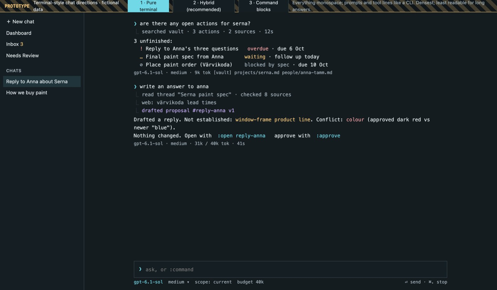
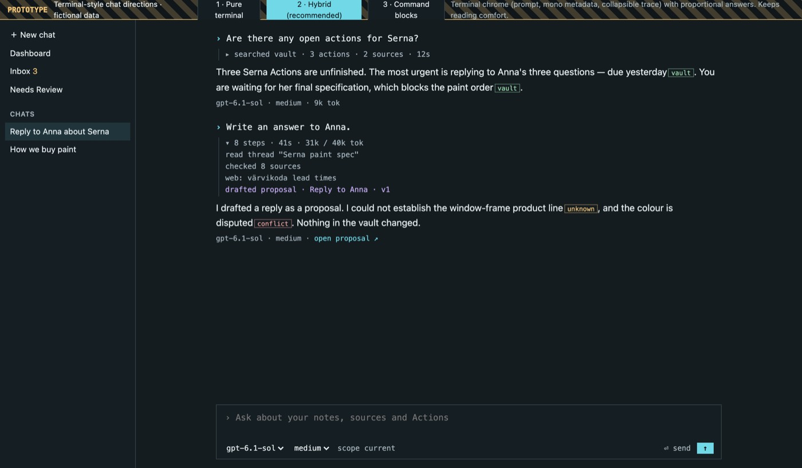
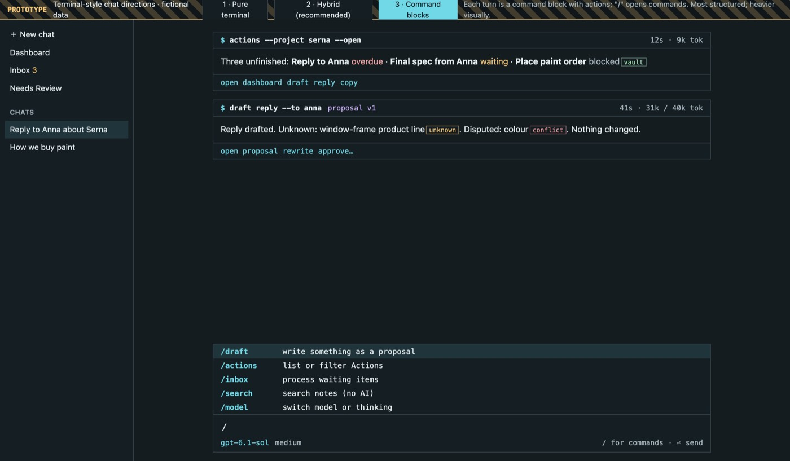

# Clickable prototype

**[Open the prototype](prototypes/brn-prototype.html)** — readiness:
**Prototype**. Fictional data, in-memory state, nothing saved. It is not the
production app; build native behaviour in the desktop crate and verify it there.

The file is self-contained HTML (`docs/design/src/prototypes/brn-prototype.html`)
and loads `../generated/tokens.css`, generated from the app's `tokens.rs`, so its
colours and type match production. Open it directly in a browser or from the
built handbook.

## Things to try

| Route | Try |
| --- | --- |
| `#today` | *Draft reply* on the first suggestion; watch the activity trail; press ⌘. to stop instead |
| `#chat` | Open the reply proposal; click claim chips to see where claims come from |
| `#review` | *Rewrite with comments* → v2; *Review exact approval…*; *I sent it — complete Action…* |
| `#inbox` | Uncheck a consequence; *Approve n selected…*; then *Review original-copy cleanup…* |
| `#needs-review` | *Review proposed update…* on the purchasing threshold; dismiss a finding |
| `#project`, `#person`, `#graph`, `#sessions` | Planned views; *Delete…* an archived chat with uncaptured outcomes |

Use the bar at the top (or `?state=` and `?scheme=` in the URL) to switch:
*Empty*, *Loading*, *Error*, *AI unavailable*, and *Light* theme.

## Terminal-style chat directions

**[Open the terminal chat prototype](prototypes/terminal-chat.html)** —
readiness: **Prototype** (decision D22). Switch variants with the bar, keys 1–3
or `?v=a|b|c`.

| 1 · Pure terminal | 2 · Hybrid (recommended) | 3 · Command blocks |
| --- | --- | --- |
|  |  |  |

## Verified behaviour

A Playwright script (headless Chromium 1243) exercises the journeys above,
every route, all states, the light theme, keyboard focus visibility, ⌘N and a
900 pt-wide viewport, and checks for console errors. Results are in the
[verification record](verification.md#prototype).
