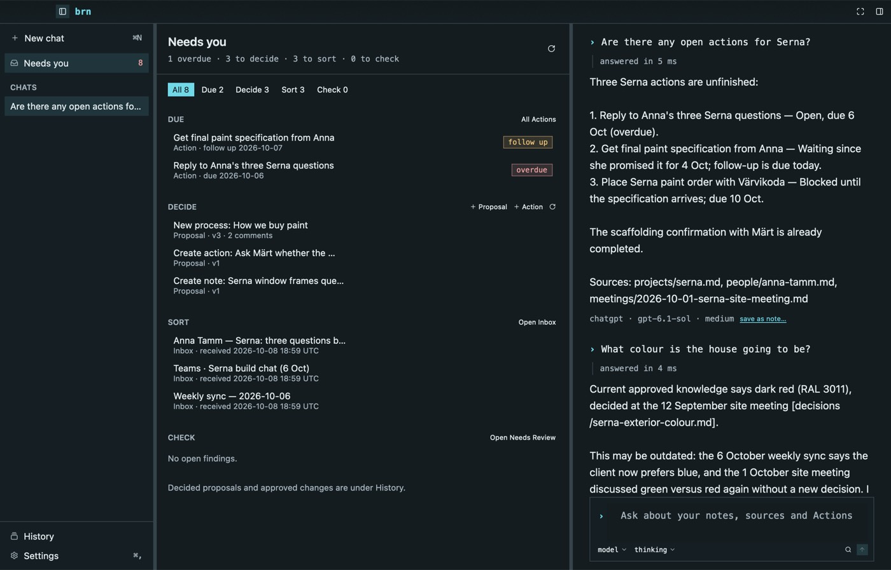
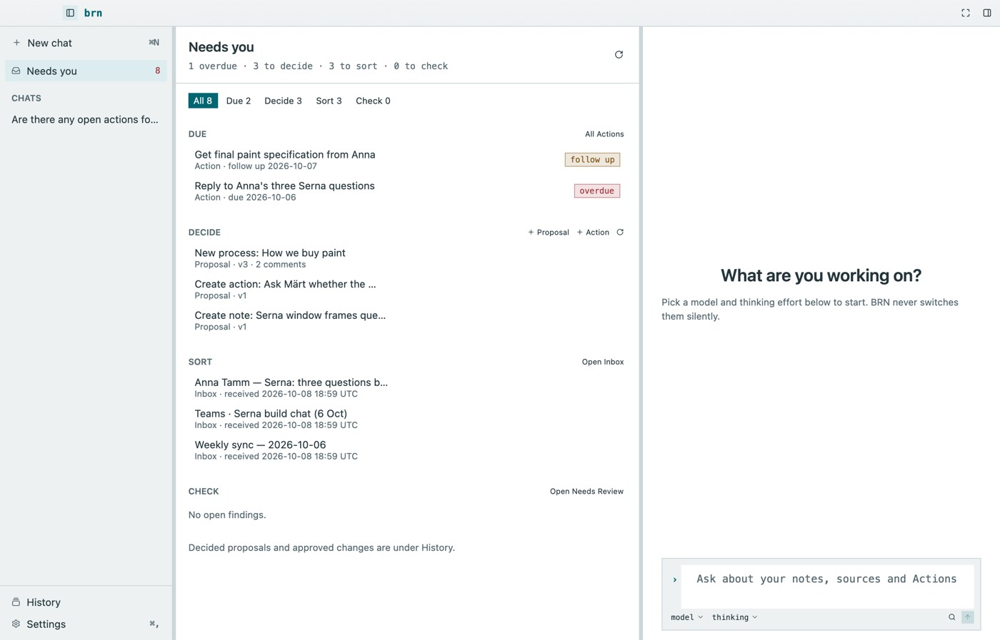
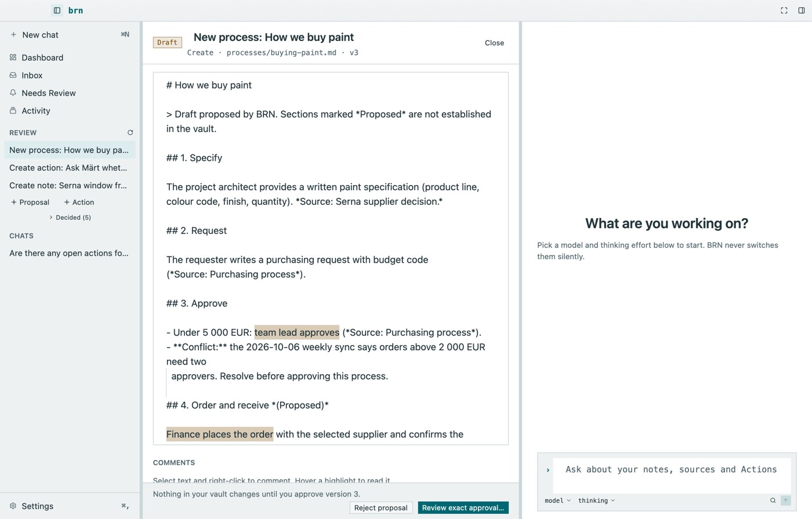
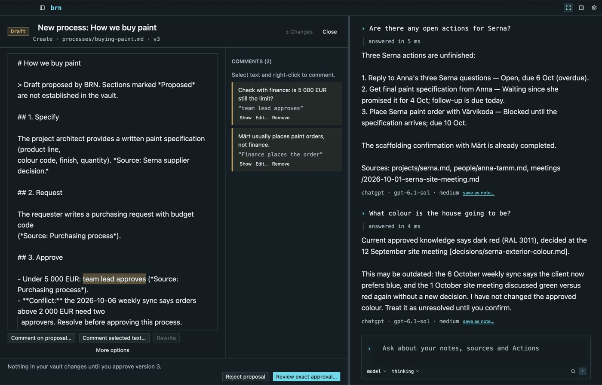
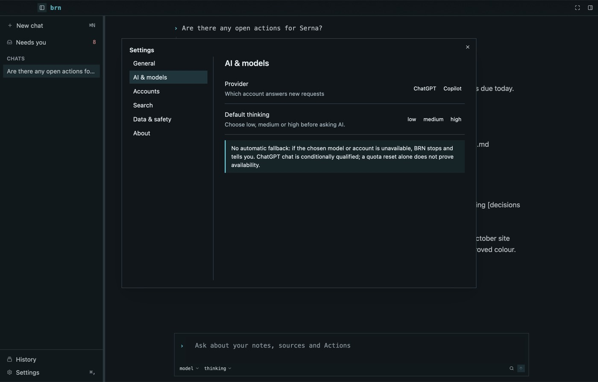
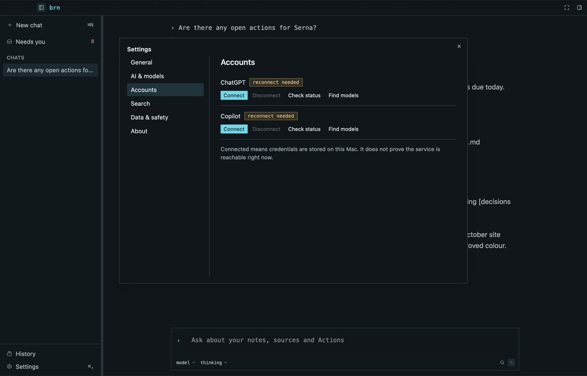

# Current app screens

All screens on this page are **Implemented**. Images are real renders of the
production view tree over the synthetic demo workspace
(`scripts/design-capture.sh`), drawn by the toolkit's headless Metal renderer at
1280 × 820 pt. That is *visual* evidence of the implemented appearance; it is not
native window, keyboard or owner verification (see the
[verification record](verification.md)). *Before* images are the same views on
the baseline `3d59cdd`.

## Home: chat with no conversation

| Before | After |
| --- | --- |
|  |  |

Changes: proportional type; structured navigator (Workspace, Chats, Review with
counts); setup-aware welcome with a vault/model checklist, *Open Settings* and
example questions; composer without code-editor line numbers; vault rail with
scope meaning and titled notes; status moved to a bottom strip.

## Chat conversation

| Before | After |
| --- | --- |
|  |  |

Question and answer are distinct; each answer shows **BRN**, the recorded
provider · model · effort in monospace and a status badge. *Review as new note…*
is a quiet row action instead of a full-width button. Provenance chips are not
implemented yet ([future](screens-future.md)).

## Needs you (D24, owner choice 2026-10-08)

One sidebar entry replaces Dashboard, Inbox, Needs Review and the proposal list.
Its count adds proposals waiting for a decision (always live) to the last known
Due, Sort and Check counts; those pages load when *Needs you* opens and the
sidebar keeps their last counts afterwards. The page groups rows by what the
owner must do — **Due** (overdue or follow-up Actions), **Decide** (proposals,
plus *+ Proposal* and *+ Action*), **Sort** (Inbox), **Check** (open findings) —
with filter chips. Rows open the existing views unchanged; *All Actions*, *Open
Inbox* and *Open Needs Review* keep their former element ids. Decided proposals
moved to **History** (the Activity view) behind *Decided proposals (N)*. Opening
*Needs you* resets the Actions filter to Active and findings to Open. Due rows
come from the newest active Actions page; when the store counts show more
overdue or follow-up Actions than that page holds, a hint points to *All
Actions*, and an Action that is both overdue and due for follow-up counts once.

## Dashboard (light and dark)

| Before | After |
| --- | --- |
|  |  |

Count tiles carry tone only when non-zero (Overdue red, Follow-up amber); Action
rows show title, state, due/follow-up and owner with separate state and signal
badges; filters are a segmented control; *Complete…* is the primary command.

## Inbox

| Before | After |
| --- | --- |
|  |  |

The waiting originals now come **first**, as cards with kind badge, title,
received time (UTC) and availability; processing, cleanup and Source preparation
follow; *Add a copy* and the approved-Source analysis come after the queue.

## Proposal review

| Before | After |
| --- | --- |
|  |  |

Header with *Proposal · Draft* badge, title and exact identity; trust callout;
labelled sections (Title, Changes with kind badges, before/proposed text, source
versions, Comments and Rewrite, Review state); and a **pinned decision bar**
naming the exact version, with *Reject* and the primary *Review exact approval…*.

### Writing review (light), after owner feedback 2026-10-08

Compact one-row header; the proposed text fills the pane in the reading font;
the two seeded comments show as amber highlights (hover shows each comment);
the decision bar states the consequence and holds Reject and Approve.

### Margin comments and Changes (D26)

When the document pane is at least 600 pt wide (for example in Focus, ⇧⌘⏎),
comments move to a 260 pt right margin: comment text, the quoted anchor, and
*Show* (selects the text), *Edit…*, *Reattach…* (moves the comment to the
selected text) and *Remove*. Narrower panes keep comments below the text
with a hint to widen. **± Changes since vN** compares the editor text with the
previous version displayed in this session: added or rewritten text is tinted
green with a hover note, and the margin lists each change with *Show*. Earlier
versions are not stored by the workflow, so the toggle stays disabled until a
newer version arrives while the app is open. **Sources** marks are not built:
they need claim-level provenance the workflow does not record.

## Needs Review, Activity, note and evidence

| Needs Review | Activity |
| --- | --- |
|  |  |

| Note (current, editable) | Source evidence (read only) |
| --- | --- |
|  |  |

Notes show *Current · editable* (green); evidence shows *Source · read only*
(cyan) or *History · read only*. *Save to Markdown* is primary; recovery tools
are quiet; *Save a copy* is its own labelled group.

## Settings (D25)

| General | AI & models | Accounts |
| --- | --- | --- |
|  |  |  |

A tabbed window (General, AI & models, Accounts, Search, Data & safety, About)
with one decision per row. The rail-width +/− buttons are gone (drag the edges;
*Reset layout* remains). Provider, model and default thinking keep their
existing commands and ids; the no-fallback rule and the meaning of
"connected" are stated where they apply.

## Known limitations of the current implementation

- Recorded times show in UTC; local time display is an open preference.
- Approved reply/Action shortcuts, claim chips, activity trail with budget,
  grouped Inbox review, Today, projects, people, graph and chat lifecycle are
  future designs.
- Proposal and Action dialogs (approval, completion, Undo, repair) keep their
  previous layout apart from theme and type changes.
- Several low-level recovery commands remain visible as quiet buttons; hiding
  them until relevant needs per-control test review.
- Toolkit accessibility (VoiceOver) is unqualified.
