# Future designs

Everything on this page is **Future design**; images come from the clickable
[prototype](prototypes.md), labelled PROTOTYPE, with fictional data. They show
layout and interaction intent, not working functionality. Each design lists
the assumptions it depends on.

## Today (home) with suggested focus

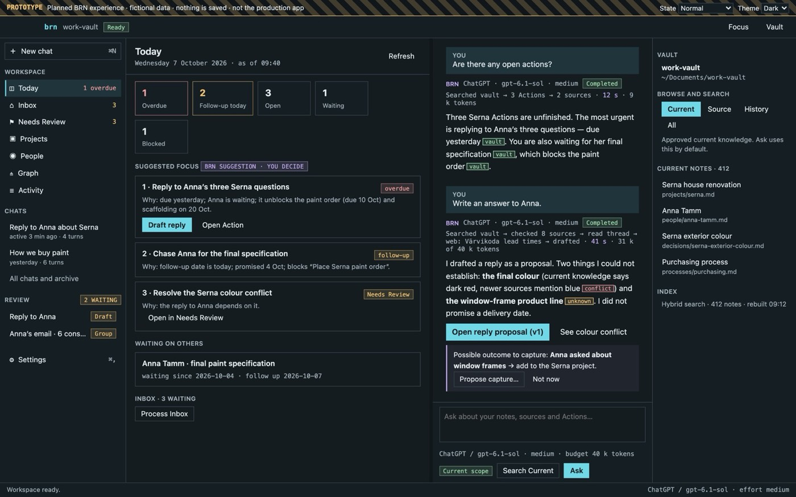

- Count tiles as on the Dashboard, then **Suggested focus**: an ordered list
  where each item states *why* (due, who is waiting, what it unblocks), marked
  “BRN suggestion · you decide”, with the next step (*Draft reply*).
- *Waiting on others*, Inbox and Needs Review summaries follow.
- Assumes: a workflow ranking with explanations; no hidden priority score.

## Chat with provenance and activity trail

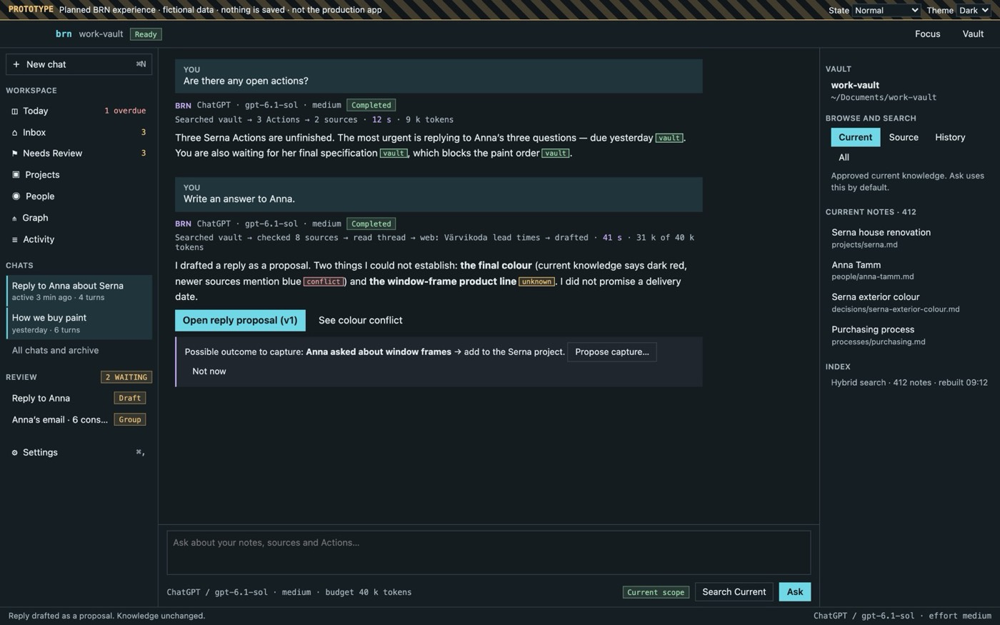

- Each answer: **BRN** label, recorded provider · model · effort, status badge,
  and a one-line **activity trail** (“Searched vault → checked 8 sources → web →
  drafted · 41 s · 31 k of 40 k tokens”). Raw tool transcripts stay hidden.
- Claims carry chips: `vault`, `source`, `web`, `proposed`, `unknown`,
  `conflict`; each opens its evidence.
- Writing requests produce a **proposal**, not a final answer in chat.
- Possible durable outcomes appear as an AI-tone callout with *Propose
  capture…* / *Not now*.
- Assumes: structured citations and claim kinds; provider usage reporting;
  configurable budget (amendment: visible, configurable, cancellable).

## Reply proposal: comments, Rewrite, approval, completion

| Version 1 with comments | Approved, then completed |
| --- | --- |
| 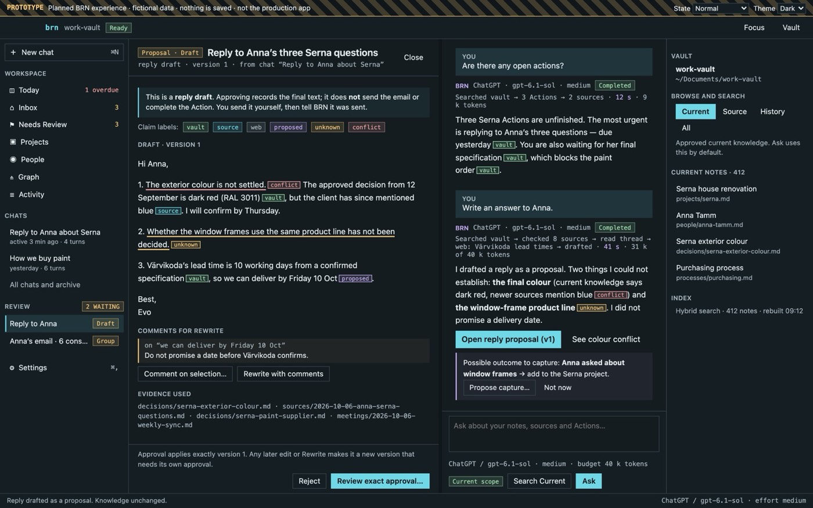 | 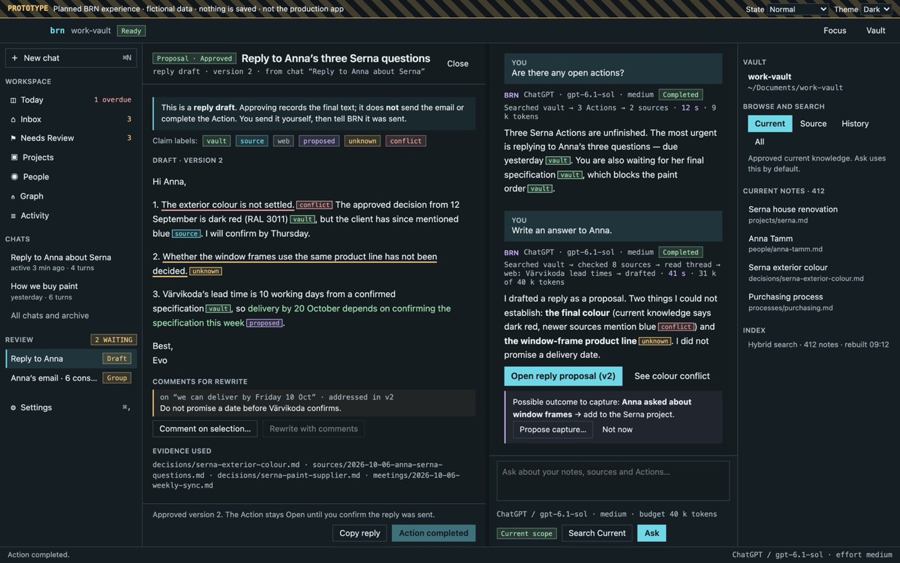 |

- A callout states that approving a reply does not send it or complete the
  Action. After approval the decision bar changes to *Copy reply* and
  *I sent it — complete Action…* (explicit confirmation).
- Rewrite with comments creates version 2; the decision bar always names the
  version that would apply.

## Inbox review group

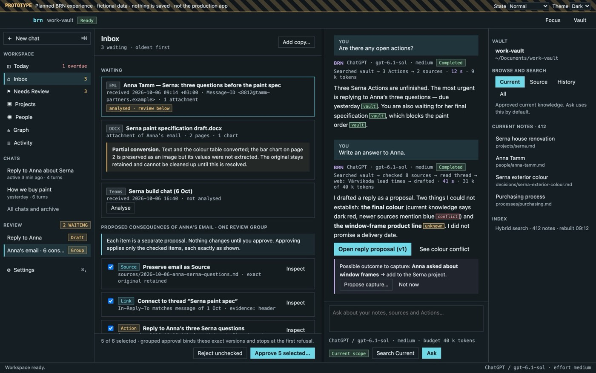

- Original items first (EML with headers and attachment count; DOCX attachment
  with a **partial conversion** callout; Teams copy not yet analysed).
- Consequences of one item as a checklist of independent proposals with kind
  badges and *Inspect*; one decision bar: *Reject unchecked* and *Approve n
  selected…*, which confirms the exact list and stops at the first refusal.
- Cleanup appears only after approval and excludes partially converted originals.
- Assumes: real EML import (P2), grouped listing in the workflow.

## Needs Review: conflicts, supersession, staleness

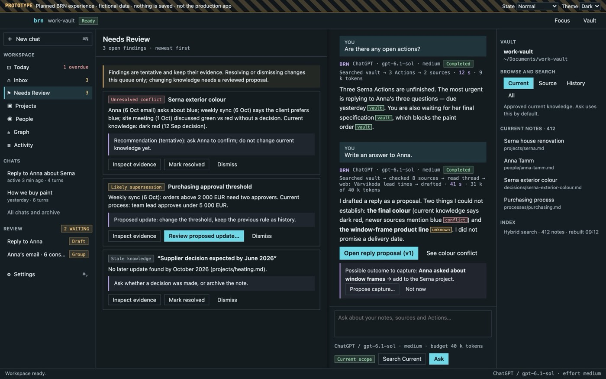

Each finding: kind badge, both sides of the evidence in words, BRN's tentative
recommendation (AI tone), *Inspect evidence*, and either *Review proposed
update…* (supersession with a diff that keeps History) or *Mark resolved* /
*Dismiss* (queue-only). Assumes P4 detectors.

## Project and person views; chats and archive

| Project | Chats and archive |
| --- | --- |
| 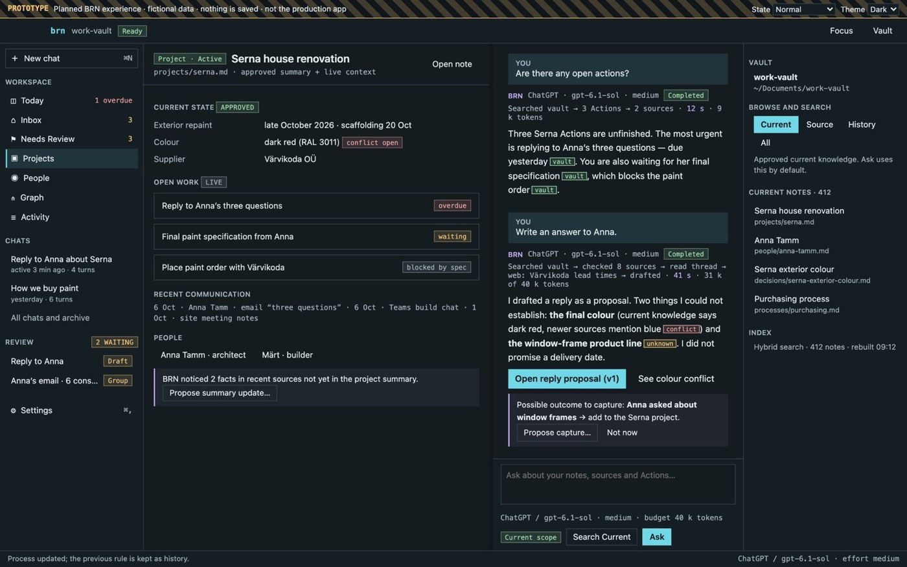 | 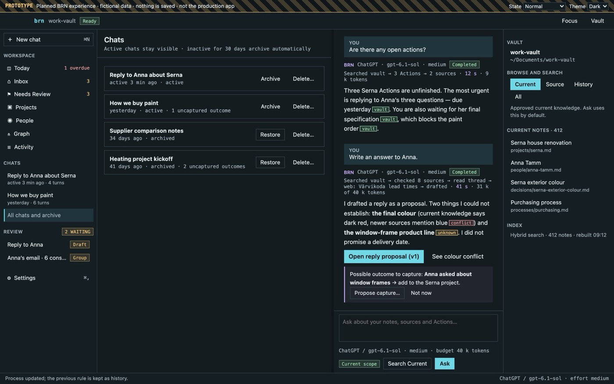 |

- Project: approved summary (green) separated from live context (open work,
  recent communication, people), plus an AI suggestion to update the summary.
- Person (in the prototype): “What am I waiting for from Anna?”, commitments,
  projects, and identity confirmation that never merges on weak evidence.
- Chats: active and archived sessions, Restore, and Delete that warns about
  uncaptured outcomes and keeps captured knowledge.
- Assumes: P8 projections; P9 session lifecycle.

## States: offline, error, light theme, narrow

| AI unavailable | Provider failure |
| --- | --- |
| 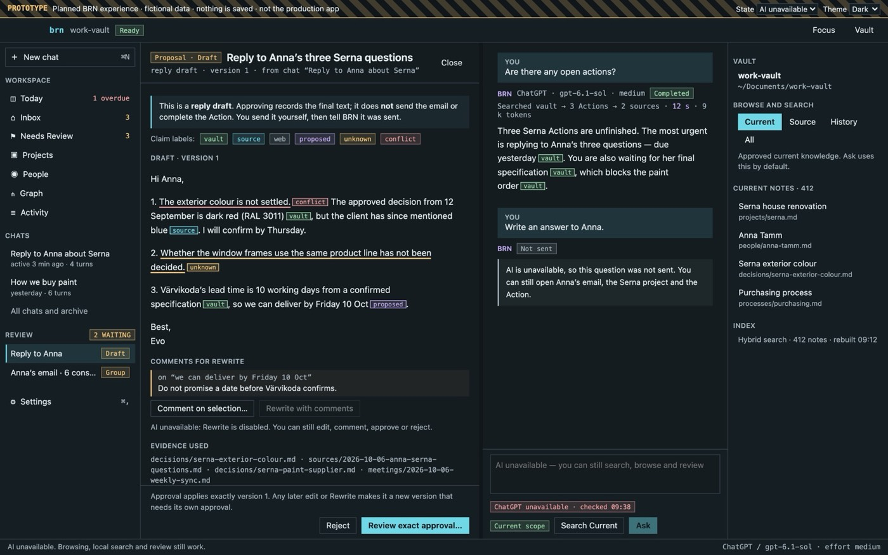 | 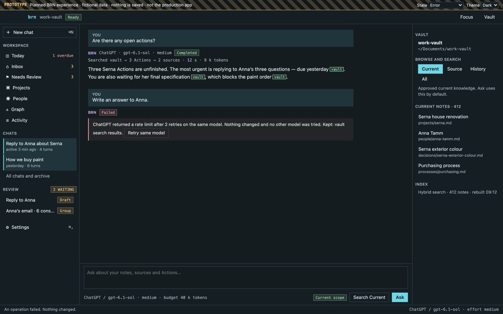 |

| Light theme | Narrow window |
| --- | --- |
| 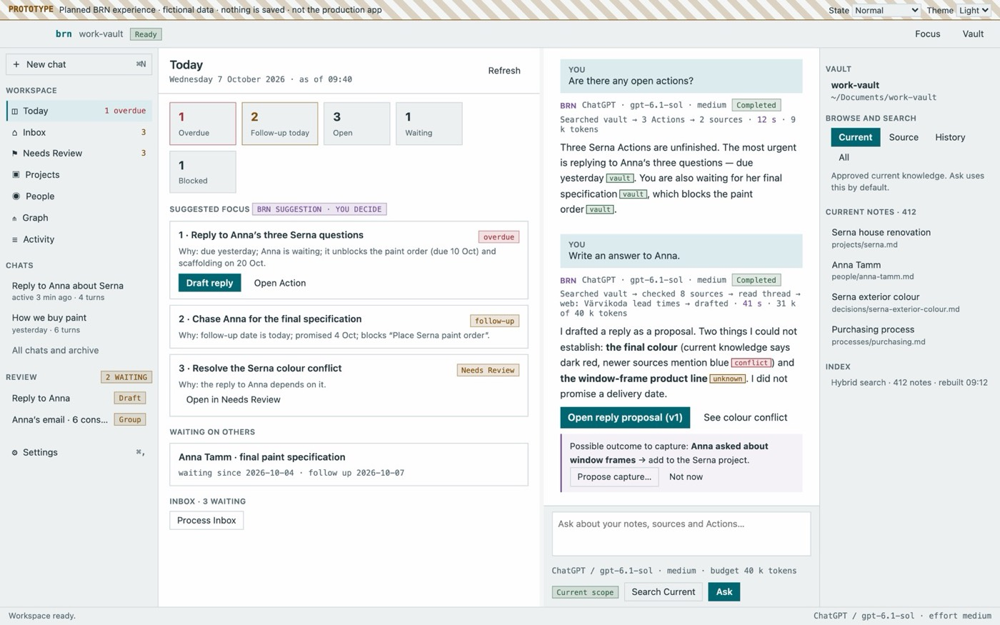 | 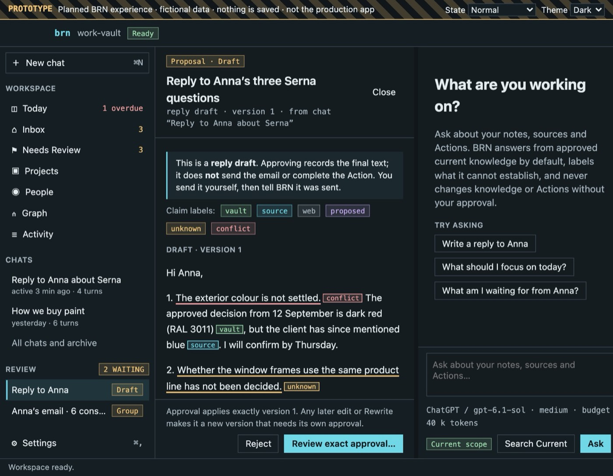 |

- Offline: Rewrite and Ask are disabled with the reason; approve, reject,
  comment, browse and search still work.
- Failure: says the same model was retried and nothing else was tried, what was
  kept, and offers *Retry same model*.

## Graph

The prototype's *Graph* shows notes as nodes coloured by kind with saved
relationships solid and derived suggestions dashed; selecting a node opens it
beside the chat. Assumes the P8 relationship view; no graph datastore.
